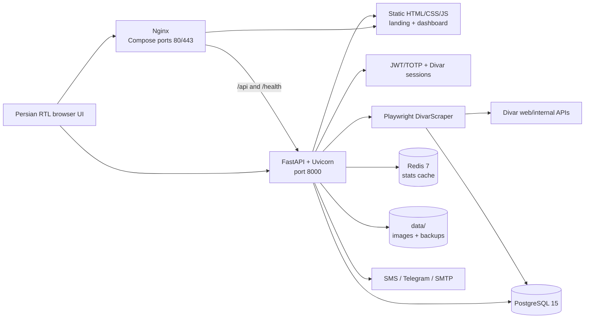
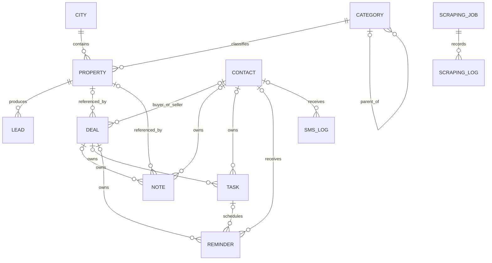
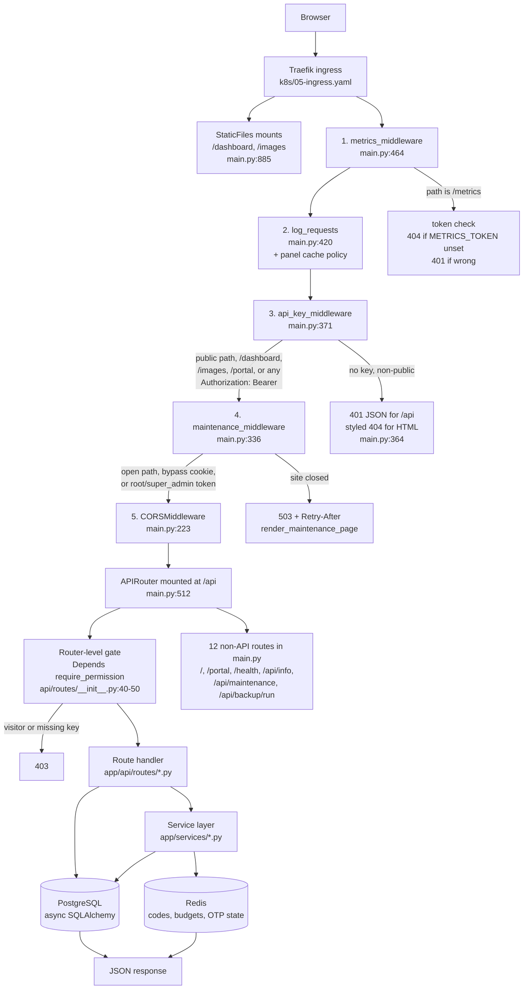
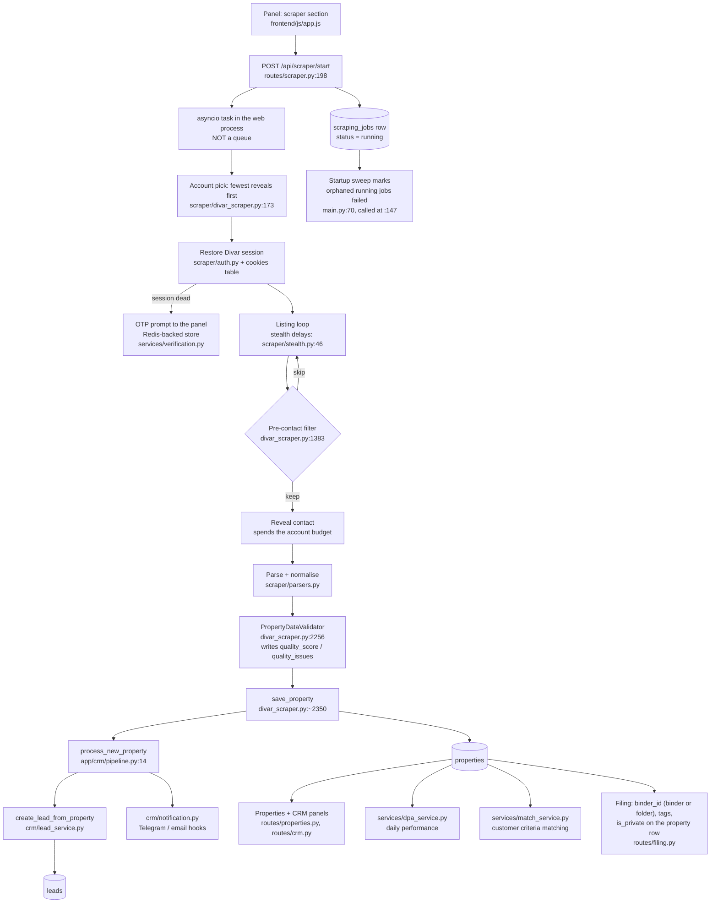
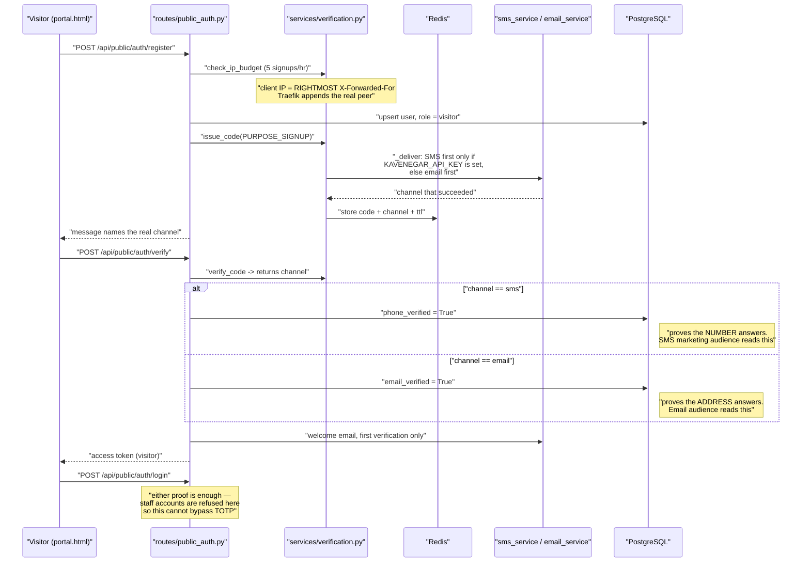

<div align="center">

# SorinFlow

**Divar property collection, data management, and real-estate CRM in one Persian RTL workspace.**

[](https://fastapi.tiangolo.com/)
[](https://playwright.dev/python/)
[](https://www.postgresql.org/)
[](LICENSE)

</div>

SorinFlow is a FastAPI application for collecting real-estate listings from Divar, managing the resulting property inventory, and moving new opportunities through a built-in CRM. It combines a Playwright scraper, PostgreSQL data model, Redis-backed analytics cache, role-aware dashboard, Divar session management, and a Kavenegar SMS panel and an SMTP email panel (each with its own router, permission key, encrypted credential store, templates and audience builder), and optional Telegram and Google Cloud integrations.

> [!CAUTION]
> This repository can process phone numbers, browser sessions, and other personal or confidential data. Use it only where you have permission and a lawful basis, respect Divar's terms and rate limits, and apply appropriate retention and access controls.

> [!IMPORTANT]
> Runtime secrets and session artifacts **were** once tracked here despite matching `.gitignore` rules. They have since been untracked and purged from history — nothing matching those patterns is tracked today. The rotation advice still stands, because purging history does not un-publish anything that was already cloned: treat any credential, cookie, or private key that was ever committed as compromised, and rotate or revoke it. On the Divar side that also means signing out unrecognised devices, which expiring a session file locally does not do.

**Navigate:** [Project brain](#project-brain) · [Architecture](#architecture) · [Quick start](#quick-start) · [API](#api-overview) · [Configuration](#configuration) · [Developer map](#developer-change-map) · [Operations](#operations)


**راهنمای فارسی برای کاربران پنل:** [`README.fa.md`](README.fa.md) — every section, as it is today.

## What the project includes

- **Divar collection:** configurable city/category jobs, exact-date and recency modes, price/area/room/amenity filters, advertiser filtering, duplicate updates, single-listing collection, and **saved schedules** that fire daily at a Tehran hour as their owner.
- **Authenticated contact extraction:** Divar phone/OTP sessions owned per user (usable only by their owner; root and super_admin see the whole list to reassign), several numbers per person with a primary, cookie import and refresh, scrape-time OTP pause/resume, identity-wall detection, and an **Android forwarder app** that delivers Divar's SMS codes to the waiting browser in seconds (its APK is mirrored from GitHub and served from this site).
- **Property inventory:** Persian-aware parsing, stable Divar IDs, human-facing tags, incremental serial numbers, local JPEG image storage, filtering, pagination, soft deletion, and JSON/CSV export.
- **CRM:** the **call queue** («تماس‌های امروز» — the leads whose turn it is, one tap per outcome, retries that come back on their own, calls per consultant), leads, contacts, structured customer profiles, tasks, deals, notes, reminders, calendar, SMS logs, lead notifications, reporting, and daily performance assessment (DPA).
- **Dashboard security:** username/password JWT login, optional TOTP or emailed second factor, self-service password reset, a **profile page** (avatar, headline, bio, links, presence; email and phone verification by code; password change that signs other devices out via a token version), four roles (`root`, `super_admin`, `admin`, `visitor` — the first three reach the dashboard, the fourth is portal-only), a 12-key permission catalogue, and super-admin account management including «request verification» nudges.
- **The panel on a phone:** a PWA (manifest, service worker that caches the shell and never the API, install hint), every asset served from the site rather than a CDN, thumb-sized controls, and browser errors reported home to the monitoring page with the browser's name.
- **Operations:** PostgreSQL, Redis, Kubernetes (k3s) manifests, a GitHub Actions workflow that deploys through a self-hosted runner and rolls back on its own when the new pod never comes up, `/ready` with real database checks, nightly JSON backups sealed and shipped to Telegram, and a runbook that rebuilds the server from a backup bundle.

## Project brain

Read this before changing anything. Where this section and the rest of the README disagree, this section is the one that was checked against the code.

**What it is.** One FastAPI process that scrapes Divar listings with Playwright, stores them as a property inventory, and works them through a CRM — plus a public customer portal bolted on the side. Persian/RTL throughout. It runs live at `sorinflow.com` on a single-node k3s cluster on an Iranian VPS behind Traefik. `main` is the only branch and pushing to it deploys to production, so the pytest gate in CI is the only pre-production environment that exists.

**Moving parts.**

| Part | Where | Notes |
|---|---|---|
| API | 14 routers mounted at `/api` (`app/api/routes/__init__.py:14-50`) | 189 application endpoints; CRM alone is 65 |
| Non-router routes | 12 defined in `app/main.py` | `/`, `/portal`, `/health`, `/api/maintenance`, `/api/public/stats`, the `/dashboard` and `/images` mounts |
| Data model | 20 tables across 8 modules under `app/models/` | created by `Base.metadata.create_all`, then patched |
| Frontend | three separate HTML documents, no build step | `index.html` (staff panel, 12 sections in one file; `js/app.js` plus one file per AI agent under `js/ai/`), `portal.html` (visitor, zero CDN), `landing.html` |
| Services | 18 modules under `app/services/` | backups, SMS, email, verification, maintenance, matching, Excel, GCP, **`llm.py`** (the one door to the model gateway) |
| AI agents | 6 under `app/ai/` | the explainer (in `match_service`), listing reader, need parser, embeddings, photo tagger, the Telegram assistant |
| Background | 15 loops + one boot-time cleanup, started in lifespan (`app/main.py`) | reminders, backups, lease expiry, session verifier, proxy refresh, forwarder watch, APK mirror, scrape schedules, match engine, price watch, morning digest, listing reader, embeddings, photo tagger, the assistant's Telegram poll, GCP exporter |

**Auth is two systems, not one.** Four roles (`root`, `super_admin`, `admin`, `visitor`) in `app/auth/permissions.py:17-32`. `root` and `super_admin` bypass permission checks; `admin` is filtered through an 11-key permission list stored as JSON on the user row; `visitor` is refused by `_staff_check` before the list is read. The gate that matters is `Depends(require_permission(k))` applied at the **router** level, so a handler that looks unguarded usually is not — check `app/api/routes/__init__.py` first. `visitor` accounts hold perfectly valid JWTs, so "authenticated" stopped meaning "belongs in the panel" the day the portal shipped.

**Migration lock discipline.** Schema history is two layers. The hand-written idempotent steps listed in a tuple in `init_db()` (`app/database.py`) bring any older database up to the Alembic **baseline** (`migrations/versions/0001_baseline.py`); everything after the baseline is an Alembic revision, applied by the app at boot (`_alembic_sync`: a fresh database is stamped at head, a pre-Alembic one is stamped at the baseline and upgraded, a versioned one is upgraded). The rules, each of which was paid for, apply to both layers:

- Every step runs in **its own** `engine.begin()`. One shared transaction meant a single failure poisoned the rest and the rollback undid `create_all` too.
- Every step runs `SET lock_timeout='5s'` and `statement_timeout='120s'` first (`_guard`, `app/database.py:150-166`).
- Query `information_schema` **before** issuing an `ALTER`. `ADD COLUMN IF NOT EXISTS` takes `ACCESS EXCLUSIVE` before checking whether there is work to do; a no-op ALTER queued behind the old pod's lock killed two rollouts (`app/database.py:664-694` names them).
- Exactly one step may stop the boot: `_verify_auth_v2` (`app/database.py:731-772`) refuses to start on a half-migrated `users` table, because those five columns are read on every User query.

Ordering is the tuple; idempotence is each step's own job. A new schema change is an Alembic revision, not a new step: change the model, `alembic revision --autogenerate -m "add x"`, read the file, commit it — the next deploy applies it under the same `lock_timeout` guard. `alembic check` must stay clean (`tests/test_pg_migration.py` enforces it on Postgres), which is why the models declare exactly the constraints the steps create (the partial `ix_users_phone_unique`, `fk_cookies_owner`, `ix_crm_sms_logs_campaign_sent`).

**Single replica, ReadWriteOnce, `strategy: Recreate`.** Three PVCs, all RWO, one backend pod (`k8s/04-backend.yaml:19-37`). Two overlapping pods would fight over the data volume and deadlock on migration locks, so deploys use `Recreate` — every deploy is a few seconds of real downtime, accepted deliberately. The consequence to keep in mind: a pod that fails startup is now a full outage, not a failed deploy that leaves the old pod serving. Comments in `app/database.py:740-742` and `SECRETS.md:245-248` still assume the old behaviour; they are wrong.

State that lives in the process, not the database, and therefore dies with the pod: running scrape tasks, Divar login sessions (`auth_instances`, `app/api/routes/auth.py:31`), and OTP suppression. `_release_orphaned_jobs` runs before anything can create a job, which is what makes it safe to fail every `running` row it finds (`app/main.py:70,147`).

**Verification channel semantics.** A signup code is delivered by whichever channel is available — `_deliver` prefers SMS only when Kavenegar has a key, otherwise email goes first (`app/services/verification.py:197-213`). With no provider credentials, that means **every code today travels by email**. The channel is written to Redis beside the code (`:143`) and returned by `verify_code` (`:216-260`), and only that channel is credited: `phone_verified` for SMS, `email_verified` for email (`app/api/routes/public_auth.py:279-282`). They are separate columns (`app/models/user.py:36-41`) because collapsing them puts a "verified phone" tick next to a number nobody has ever answered — and `phone_verified` is what the SMS marketing audience reads as consent (`app/api/routes/sms.py:252-256`). Those SMS audiences therefore read zero, which is the honest count.

**Fail-soft legs, on purpose.** Per-IP throttling (5 signups, 10 codes per hour) and login rate limiting both **fail open** when Redis is down — a blip degrades sign-up rather than locking the office out of a live panel (`app/services/verification.py:300-322, 340-352`). Budgets are spent only after the send succeeds. `client_ip` takes the **rightmost** `X-Forwarded-For` entry because Traefik appends the real peer; taking the leftmost would let anyone reset their own budget with a forged header (`:277-295`). `secret_box.decrypt()` returns `""` instead of raising, and its Fernet key is derived from `SECRET_KEY` — rotating that key silently invalidates every panel-saved credential and the only symptom is a warning line.

**Other rules that are not obvious from the code they govern.**

- Middleware runs metrics → log → api_key → maintenance → routes (registration order in `app/main.py` is reversed). `/metrics` is not a route at all; it is served from inside the metrics middleware, which is why an unset `METRICS_TOKEN` gives 404, not 401.
- Any `Authorization: Bearer` header bypasses the API key entirely (`app/main.py:349-350`). The key gates unauthenticated paths only.
- Maintenance mode lives in `app_settings`, not memory, so a pod replacement cannot quietly reopen a closed site. Panel credentials live there too, Fernet-encrypted; environment variables always win over them.
- Credentials resolve env-first, panel-second (`app/services/sms_service.py:160-174`, `email_service.py:117-164`).
- Logs pass a redaction filter on both sinks and loguru `diagnose` is off — with it on, a connection error prints `DATABASE_URL` and its password into a file at rest on the node.
- The frontend has no module system: ~150 inline `onclick=` handlers call globals in one 8.9k-line `app.js`. `tests/test_frontend_wiring.py` parses both files to prove nothing was deleted out from under a handler; that static parse is the entire frontend safety net.

**What will bite you.**

- **The other documents are stale.** This file was rewritten against the code on 2026-09-02; `INSTALL.md` and `QUICK_START_GUIDE.md` were not. `INSTALL.md` gives a Compose sequence that hard-errors without `POSTGRES_PASSWORD`. `QUICK_START_GUIDE.md` is a June-era fix note with two links to a file that never existed. `local/start.sh`, the documented dev entry point, is git-ignored and absent from a fresh clone. `README.fa.md` was deleted in `ce2f1e6` rather than corrected — there is currently **no Persian-language guide**, which for this product's users is a gap, not a tidy-up.
- **CI applies only two manifests** — `04-backend.yaml` and `05-ingress.yaml`. Namespace, Postgres, Redis and the Traefik ACME config drift silently.
- **A Secret key with no matching `env` entry in `04-backend.yaml` never reaches the pod**, so `kubectl patch secret` for it is a silent no-op. `LLM_API_KEY`/`LLM_BASE_URL`/`LLM_MODEL` and `SUPER_ADMIN_PASSWORD` are wired now; the `GCP_*` block is still in that state. The LLM trio is managed as GitHub Actions secrets — the deploy copies them into the cluster (`SECRETS.md` §2d).
- **The nightly backup is every table** — password hashes, TOTP secrets, live Divar session JSON included — so the copy that leaves the server is sealed under a key derived from `SECRET_KEY` before it goes to Telegram (`app/services/backup_service.py`, `seal()`); the local copy stays plain on the volume that already holds the data. `scripts/restore_backup.py` imports every model module and opens the sealed `.enc` copy under the same key. Telegram credentials are entered on the admin panel (token encrypted) or via `TELEGRAM_BOT_TOKEN`/`TELEGRAM_CHAT_ID`, environment first.
- **Tests skip quietly on SQLite.** A local run is 739 passed / 31 skipped; the 22 skipped in `tests/test_auth_roles.py` are the behavioural role and permission attacks. CI supplies real Postgres and Redis. House rule, stated by the owner: leave a test that fails without the fix, and revert it once to watch it go red.
- **Untested surface is the request layer.** No test imports any route module; `app/api/routes/crm.py` alone is 2,177 lines. 28 handlers take a raw `dict` body with no schema.
- The panel loads nine assets from jsDelivr and code.jquery.com with no fallback, while byte-real local copies of four of them sit unreferenced in `frontend/`. On an Iranian network that is the panel's most exposed dependency.
- **The scraper's depth comes from one replayed request.** `_collect_from_browser_dom` scrolls to a cap of 200; everything past that is `_fetch_listings_direct_api` replaying the browser's own `/postlist/w/search` POST with an advanced cursor. That replay was gated on a cursor it could only obtain by first succeeding, so it produced nothing in any run until 2026-09-02 and every scrape was silently capped at whatever the scroll reached. The legacy `/v8/web-search` GET it fell through to is dead — it answers HTTP 200 with a `BLOCKING_VIEW` «نیاز به بروزرسانی» and zero listings — and is deleted. If depth breaks again, look at the cursor first: `self._dom_cursor`, captured in the response listener, seeds the API phase.
- **Divar's session cookie is `sAccessToken`, not `token`.** They moved to SuperTokens. Seven places hard-coded the old name, which cost a 30-second dead wait on every login and produced 403s wherever a stale `token` survived alongside the new ones. `AUTH_COOKIE_NAMES` in `app/services/divar_session.py` is the single place that knows; a test fails if anyone hard-codes it again.
- **A run's own account of itself lives in `scraping_logs`**, written by `app/services/job_log.py` and read by the گزارش button on every job row. The application log cannot answer «این ران چرا نصفه ماند؟»: no line in `scraper.log` carries a job id, and it rotates at 10 MB with seven days of retention. Events are written on their **own** session — an INSERT that failed inside the run's transaction would abort it and turn a logging problem into a data-loss one — and `record()` never raises.
- **Divar answers 403 to any request whose token cookie it dislikes** — on every endpoint, including ones needing no login. So a 403 never distinguishes "expired" from "we sent something malformed", which is why `probe()` re-requests without a cookie before it will call a session dead.
- `_maintenance_allows` is defined twice, byte-identical, in `app/main.py` (lines 258 and 297). Edits to the first one do nothing.
- `root` is documented as unrestricted but is silently filtered like an admin on the CRM task board (`crm.py:1297`) and on private files (`filing.py:64-66`).

## Architecture



### Scrape-to-CRM lifecycle

1. A user signs in to SorinFlow and starts a job through `POST /api/scraper/start`.
2. FastAPI validates the city/category, enforces a maximum of three database-tracked running jobs, creates a job record, and starts an in-process background task.
3. `DivarScraper` restores the selected Divar session, discovers listings through browser traffic and page markup, and opens each detail page.
4. Parsers normalize Persian/Arabic digits and extract pricing, location, area, rooms, features, amenities, advertiser details, publication time, phone number, and images.
5. Filters and validation run before the property is inserted or updated in PostgreSQL. Images are converted to JPEG and saved under `data/images/`.
6. Every newly inserted property creates one CRM lead. Configured Telegram and SMTP notifications are attempted without failing the scrape if delivery is unavailable.
7. The dashboard polls job progress, pending OTP requests, properties, CRM records, and cached statistics.

Redis is used for dashboard/public-stat caching and health checks. It is **not** a Celery broker, and scrape jobs are not durable queue jobs.

### Core data model



`User`, `Cookie`, `Customer`, and `DailyPerformance` are separate aggregates rather than foreign-key children in this graph. Users and scraping jobs are associated with a Divar phone value, but that association is not enforced by a database foreign key.

## System design map

This section answers "where do I change X?" without reading the codebase. Every path below is a real file, and the line numbers were current at the time of writing — if one has drifted, the surrounding function name still holds.

### 1. A request's path

Starlette runs the **last-registered** middleware first, so the registration order in `app/main.py` is the reverse of the runtime order. The chain below is the runtime order.



Two consequences worth knowing before you touch the chain:

- **Any** `Authorization: Bearer …` header satisfies `api_key_middleware` (`main.py:349`), so `API_KEY` gates unauthenticated non-public paths only — it is not a second factor for logged-in callers.
- `maintenance_middleware` is the innermost of the four, and it fails **open** if its own check raises (`main.py:296-299`). A browser hitting `/dashboard` sends no bearer header, so the practical way in during a closure is the `/maintenance-access` bypass cookie, not the JWT branch.

### 2. Scrape to CRM lifecycle



The scrape lives inside the web process, which is why `strategy: Recreate` (`k8s/04-backend.yaml:36`) plus the orphan sweep exist: a deploy kills the task, and without the sweep the row says «در حال اجرا» forever.

### 3. Sign-up and verification

The channel that actually carried the code is recorded, and only that channel is credited. With no Kavenegar credentials configured, that means every code today travels by **email** and `phone_verified` stays false.



`GET /api/public/auth/status` is the one endpoint in this router with no `PUBLIC_AUTH_ENABLED` gate — the login page, the landing page and the portal all read it to decide whether to show sign-up.

### 4. Where to change what

| Task | Open these | What else must change |
|---|---|---|
| **Add an API endpoint** | The router in `app/api/routes/`; `app/schemas/__init__.py` for the request/response model | Nothing to mount if the router already exists — the router-level `Depends(require_permission(...))` in `app/api/routes/__init__.py:40-50` covers it. New router: add the `include_router` line **and** a permission key. Frontend: add the `apiCall` in `frontend/js/app.js`. If it must answer without a token, add the path to `public_paths` in `app/main.py:328-342`, otherwise `API_KEY` rejects it before the handler. |
| **Add a database column** | The model in `app/models/` | **An Alembic revision.** `alembic revision --autogenerate -m "add x"` against a local Postgres, read the generated file (autogenerate cannot see data backfills or partial indexes' `WHERE`), commit it under `migrations/versions/`. The app applies it at boot under `_guard` (`lock_timeout='5s'`); a revision that needs longer, or a lock the old pod may hold, is the same deploy-deadlock hazard as before — keep it to one `ALTER` per transaction. If the column is read on every `User` query, add it to `_verify_auth_v2`. `tests/test_pg_migration.py` runs `alembic check` against real Postgres in CI, so a model that drifts from the schema fails the build. Add it to the `to_dict()` if the model has one. Do **not** add a new step to the `init_db()` tuple — those exist only to bring pre-baseline databases up. |
| **Add a panel page (section)** | `frontend/index.html` — a `#section-<name>` div plus a `nav-link-<name>` entry; `frontend/js/app.js` — the loader and the `showSection` switch | Add the section to `NAV_PERMISSION` and `SECTION_PERMISSION` (`app.js:614-633`) **and** to `ROUTE_SECTIONS` (`app.js:548`) or the hash route will be write-only. Add the matching permission key (row below). Add the inline `onclick` handlers to `tests/test_frontend_wiring.py`'s expectations — it parses both files and fails on a missing function. |
| **Add a scraper filter** | `app/scraper/divar_scraper.py` (the listing loop and the pre-contact skip at `:1383`); `app/scraper/parsers.py` for anything derived from listing text | Add the field to `ScrapingJobConfig` in `app/schemas/`, to the scraper form in `frontend/index.html`, and to the job payload in `app.js`. If it is persisted on the job, that is a column — see the migration row. Timing knobs are `SCRAPER_DELAY_MIN`/`MAX` in `app/config.py`, read by `StealthConfig.__post_init__`. Defaults 2–5s, heavy-tailed, with exponential backoff on any refusal — do not tighten them to go faster; the old 0.35–0.9s is what was getting the accounts blocked. |
| **Change a role or permission** | `app/auth/permissions.py:37-49` (the key → Persian label dict) and one `_perm("key")` line in `app/api/routes/__init__.py` | Keys deliberately match router names — a dict entry plus a gate is the whole backend job. Frontend: `NAV_PERMISSION`/`SECTION_PERMISSION` in `app.js:614-633`. Existing accounts do not gain a new key automatically; either add it to `DEFAULT_ADMIN_PERMISSIONS` (`permissions.py:54`) or backfill in a migration. Role tiers themselves (`STAFF_ROLES`, `FULL_ACCESS_ROLES`, `ASSIGNABLE_BY_SUPER_ADMIN`) are at `permissions.py:17-32`; `require_permission` and `_staff_check` are at `app/auth/dependencies.py:86-117`. |
| **Add a notification template** | Email: `app/services/email_templates.py`, then reference it from the caller (`routes/portal.py`, `routes/public_auth.py`, `services/verification.py`). SMS: `app/services/sms_service.py` | Email templates are listed by `GET /api/email/templates` and previewed by `/api/email/preview/{name}` — a new one shows up in the panel automatically. Kavenegar template names are stored in `app_settings`, not env: `KEY_OTP_TEMPLATE` in `sms_service.py:58`, edited from the SMS settings screen. Note `send_verify()` (`sms_service.py:260`) has no callers — codes currently go out over `send_sms()`. |
| **Change or add a secret** | `.env.example` (name and comment, **no value**); `app/config.py` (the `Field(..., env="NAME")`); `k8s/04-backend.yaml` (an `env:` entry with a `secretKeyRef`, `optional: true` unless the pod must not boot without it) | **All three, or it silently does nothing.** A key added to the Kubernetes Secret with no matching `env:` entry never reaches the process, so `kubectl patch secret` is a no-op — this is exactly how eleven keys sat dead for weeks. Panel-saved credentials (SMTP password, Kavenegar key) are Fernet-encrypted under a key derived from `SECRET_KEY` (`app/services/secret_box.py:25-28`): rotating `SECRET_KEY` makes them unreadable and they must be re-entered. Env always wins over the panel value. |
| **Add a background task** | `app/main.py` lifespan (`:147-180`) | Create the task **and** cancel it in the shutdown block. Insert it outside the `@asynccontextmanager` / `async def lifespan` pair — putting a helper between the decorator and the function detaches the decorator and the app fails to start. |
| **Change what the maintenance page lets through** | `app/services/maintenance.py:186-199` (`OPEN_PREFIXES`) and `app/main.py:297-334` (`_maintenance_allows`) | `_maintenance_allows` is currently **defined twice**, byte-identical, at `main.py:258` and `:297`. The second wins; edit that one. |

### 4b. The AI agents

Six agents, one door. Everything they do goes through `app/services/llm.py`:
the connection (Liara's OpenAI-compatible gateway, key and base URL from the
environment, GitHub-managed), a model per job (`write` / `read` / `vision` /
`embed`, environment defaults overridable per job from the panel), `mask_pii`
on every string that leaves, JSON mode with a pydantic schema and one retry, a
ledger row per call carrying Liara's own cost, and a daily cap in dollars that
stops the background agents until Tehran midnight. A reasoning model (`z-ai/`,
`deepseek/`, `moonshotai/`) gets a 1500-token floor and a 90-second timeout,
because its thinking comes out of the same budget as its answer.

| Agent | When | Reads / writes | Where it shows in the panel |
|---|---|---|---|
| **توضیح‌دهندهٔ پیشنهاد** (`match_service._llm_rerank`) | when a match list is opened | writes one Persian line per candidate; the ranking stays local | «ملک‌های مشابه», «ملک‌های مناسب», the match queue |
| **خوانندهٔ آگهی** (`app/ai/listing_reader.py`) | background, every 120 s, 50 listings | `properties.ai_facts` — kind, floor, document, condition, amenities, the real district, «قابل تبدیل» / معاوضه / تخلیه / «مناسبِ…», red flags, a confidence per field | «برداشت هوش مصنوعی» on the property modal; `effective()` feeds matching and «ملک‌های مشابه» |
| **خوانندهٔ نیاز مشتری** (`app/ai/need_parser.py`) | on demand | proposes the intake form's fields; writes nothing without a person | «پر کردن از متن» on the customer form; a portal request's description refines its customer |
| **جستجوی معنایی و تکراری‌یاب** (`app/ai/embeddings.py`) | background, every 180 s, 200 listings | `properties.ai_embedding` (JSON, numpy at this scale — pgvector later) and `ai_duplicate_of` | «جستجوی معنایی» on the leads page, «شباهت متن» in the score, the «احتمالاً تکراری» badge, the assistant's search tool |
| **برچسب‌زن عکس** (`app/ai/photo_tagger.py`) | background, every 300 s, 30 listings | `properties.ai_photo_tags` from the first three photos at 512 px | the property modal's photo box, the «هوش تصویری» page |
| **دستیار دفتر «سورین»** (`app/ai/assistant.py`) | when somebody asks | six read-only tools; every question in `ai_chats` | Telegram (the backup's chats) and «بپرس» on the AI screen |

Rules that hold for all six: none of them sits on a request path that matters
(the model being down costs a sentence, never a page); every one is gated on
`MATCH_ENGINE` and on its own switch; none sends a phone number to a third
party; and a pass that only fails backs off ten ticks rather than paying for
the same failures again in two minutes.

The **هوش مصنوعی** screen (root/super_admin) is where all of it is managed:
the connection and the per-job models, the daily cap and the office's standing
notes, a card per agent with what it does, where it is used, how far its pass
has come and what it cost today and this month, a switch and a «اجرای یک دور»
button each, the filtered call log with its failures, Liara's own free-token
quota, and the assistant's questions.

### 5. Module boundary rules

Enforced by convention today, not by a linter. The arrows below are the ones that actually exist in the tree.

```
app/api/routes/  →  may import anything below it
app/auth/        →  app/models/user, app/config, app/database
app/services/    →  app/models, app/config, app/database, other services
app/crm/         →  app/models, app/config, other app/crm modules
app/scraper/     →  app/models, app/config, app/services/dpa_service, app/crm/pipeline
app/models/      →  app/database, other models
```

Rules:

- **Nothing imports `app/api/routes/`** except `app/api/routes/__init__.py` and `app/main.py`. A service that needs route logic means the logic is in the wrong file.
- **`app/services/` must not import `app/scraper/`.** The scraper depends on services, never the reverse; the one direction is what keeps a Playwright import out of the request path.
- **`app/auth/` imports only `app/models/user`, `app/config` and `app/database`.** It must not reach into services — a circular import there breaks every route at boot.
- **`app/models/` should import only `app/database` and other models.** There is exactly one live exception: `app/models/crm_models.py:535` imports `to_jalali` from `app/services/dpa_service` inside a function body. Keep any such import function-local so module import order stays acyclic.
- **`app/scraper/` reaches forward into CRM through one door:** `process_new_property` in `app/crm/pipeline.py`, called at `divar_scraper.py:2355` inside a try/except that treats CRM failure as non-fatal. Add new post-save work there, not in `save_property`.
- **The frontend is three independent documents**, not one app: `index.html` + `js/app.js` (staff panel), `portal.html` + `js/portal.js` (visitors, deliberately zero CDN dependencies), `landing.html`. They share no JavaScript and use different token keys (`sf_token` vs `sf_portal_token`). Do not import one into the other — copy the four-line helper instead.
- **Heavy or optional imports go inside the function**, never at module scope, and never in a default argument. A guarded `import cv2` was once defeated by `cv2.TM_CCOEFF_NORMED` sitting in a method signature — defaults evaluate at class creation, and the whole application failed to import.

## Technology stack

| Layer | Technology |
|---|---|
| API | FastAPI 0.109, Uvicorn 0.27, Pydantic 2.5 |
| Persistence | PostgreSQL 15, SQLAlchemy async 2.0, asyncpg |
| Cache | Redis 7 |
| Collection | Playwright 1.41, Beautiful Soup 4.12, HTTPX, aiohttp |
| Media/data | Pillow, OpenCV, NumPy, openpyxl |
| Authentication | JWT/HS256, bcrypt, optional TOTP via PyOTP |
| Frontend | Static HTML, CSS, and JavaScript; Bootstrap RTL and Chart.js |
| Operations | Docker Compose, Nginx, k3s/Kubernetes, GitHub Actions |
| Tests | pytest and pytest-asyncio |

The source uses Python 3.10+ syntax. No authoritative Python version file is checked in, so Docker is the canonical runtime.

## Quick start

### Local development — the short way

No Docker needed. `./local/start.sh` brings up PostgreSQL, Redis and the API,
creates the database on first run, and prints the logins:

```bash
./local/start.sh          # http://127.0.0.1:8010
./local/stop.sh           # stops all three, keeps your data
```

It is idempotent and safe to re-run. Local values live in `local/local.env`,
which git ignores and which never shares credentials with production — real
environment variables take precedence over `.env`, so a local run cannot pick
up a production value by accident.

Set `AUTH_SMS_PROVIDER=console` to have portal verification codes written to the
log instead of sent by SMS (refused when `ENVIRONMENT=production`):

```bash
grep sms:console local/server.log | tail -1
```

### Requirements for the Docker path

- Git
- Docker Engine or Docker Desktop
- Docker Compose v2 (`docker compose`)
- Network access to Divar and the frontend's CDN dependencies

### 1. Clone and configure

```bash
git clone https://github.com/Tecso-Dev/SorinFlow-DaTA-mAmager.git
cd SorinFlow-DaTA-mAmager

# Replace the local configuration with the documented template.
cp .env.example .env
```

Review `.env` before starting. At minimum, replace the default database, Redis, and application secrets:

```env
POSTGRES_USER=sorinflow
POSTGRES_PASSWORD=replace-with-a-strong-password
POSTGRES_DB=divar_scraper

REDIS_PASSWORD=replace-with-a-strong-password
SECRET_KEY=replace-with-a-long-random-value

# Optional supplemental middleware key; JWT remains the primary API auth.
API_KEY=

# Leave disabled until intentionally configured.
PROXY_ENABLED=false
PROXY_LIST=
# Only for a single-operator install: runs started from the panel or a
# schedule always use their owner's own Divar numbers, never this one.
DIVAR_PHONE_NUMBER=
```

Generate a secret with:

```bash
openssl rand -hex 32
```

Never commit the resulting `.env`.

### 2. Start the stack

```bash
docker compose up -d --build
docker compose ps
```

The [`start.sh`](start.sh) wrapper can also create directories, rebuild without cache, start the stack, and perform basic health checks:

```bash
./start.sh
```

### 3. Open the application

| Service | URL | Notes |
|---|---|---|
| Dashboard (recommended locally) | <http://localhost:8000/dashboard/> | Direct FastAPI route; keep the trailing slash |
| API documentation | <http://localhost:8000/api/docs> | Swagger UI |
| ReDoc | <http://localhost:8000/api/redoc> | Alternative API reference |
| Health check | <http://localhost:8000/health> | Backend liveness |
| Backend landing page | <http://localhost:8000/> | Public marketing page |
| Nginx dashboard | <http://localhost/> | Compose serves `frontend/index.html` at `/` |

Use the direct backend dashboard during local development because the bundled Nginx configuration does not currently proxy the generated `/images/...` URLs.

On an empty database, SorinFlow seeds this super-admin account:

```text
Username: admin
Password: whatever you set in SUPER_ADMIN_PASSWORD (there is no default)
```

Change it immediately from the user-management screen. Bootstrap credentials are only read when the users table is empty; changing environment variables later does not update an existing account.

### 4. First-use workflow

1. Sign in to the SorinFlow dashboard.
2. Reset the seeded super-admin password and create any additional accounts.
3. Open **Divar Authentication**, enter a Divar phone number, and complete OTP verification or import an existing cookie set.
4. Open **Scraper**, choose a city and category, set filters, and start a job.
5. Monitor progress under scraper jobs, review the property inventory, and manage automatically created leads in CRM.

## Authentication model

Three separate authentication paths:

| Path | Who | Main endpoints |
|---|---|---|
| Dashboard | staff — `root`, `super_admin`, `admin` | `/api/users/token`, `/api/users/token/verify-totp`, `/api/users/me` |
| Customer portal | `visitor`, public sign-up by SMS | `/api/public/auth/register`, `/verify`, `/login` |
| Divar session | the scraper's own browser session for contact extraction | `/api/auth/login`, `/api/auth/verify`, `/api/auth/cookies` |

Dashboard JWTs last 24 hours and carry a `typ` claim. Only a finished access
token authenticates: the half-token issued between password and TOTP is
refused, so the second factor cannot be skipped.

### Roles

| Role | What it is |
|---|---|
| `root` | The developer. Everything, always. Seeded from `ROOT_PASSWORD`, never creatable from the panel, hidden from the super admin's user list, and protected from being edited, deleted or password-reset by anyone but another root. |
| `super_admin` | The agency owner. Runs the business — staff, permissions, upgrade tickets, visitor requests. Cannot create or become a root. |
| `admin` | An employee. Reaches only the areas ticked in `users.permissions`. |
| `visitor` | A public sign-up. No dashboard at all — the portal only. |

`root` and `super_admin` bypass permission checks; a permission list is only
ever consulted for an `admin`. Permission keys are defined in
[`app/auth/permissions.py`](app/auth/permissions.py) and gate the routers in
[`app/api/routes/__init__.py`](app/api/routes/__init__.py): `properties`,
`scraper`, `crm`, `filing`, `divar_auth`, `proxies`, `stats`, `portal`,
`sms`, `email`, `forwarder`,
`monitoring`.

Enforcement is server-side at the router, not just hidden in the UI — the panel
builds its navigation from the permissions `/api/users/me` reports, so the menu
and the API cannot disagree.

### Public sign-up

**On in production.** The code default and `.env.example` still say
`PUBLIC_AUTH_ENABLED=false`, but the deployed manifest sets it to `"true"`, so
sign-up is open at sorinflow.com. While it is off, `/portal` redirects to the
dashboard and four of the five `/api/public/auth/*` endpoints answer 404 —
`GET /status` is the exception and always answers, because the login page reads
it to decide whether to show the sign-up tab at all.

A visitor registers with **both** a phone number and an email address, both
mandatory, and receives a verification code. Which channel carries that code is
decided at send time: `_deliver` prefers SMS only when Kavenegar has a key, and
otherwise sends by email with SMS as the fallback. With no provider credentials
configured — the current state — **every code travels by email**.

Only the channel that actually carried the code is credited. `phone_verified`
and `email_verified` are separate columns, because a code read out of an inbox
proves the address and says nothing about the number: collapsing them put a
verified-phone tick beside numbers nobody had ever answered, and the SMS
marketing audience reads that flag as consent to text. Either proof signs the
visitor in. The SMS audiences therefore report zero until Kavenegar is live,
which is the honest count.

A verified visitor can describe the property they are looking for — which lands
in the panel's «درخواست‌های مشتریان» screen for staff to call — and can request
an upgrade to `admin`, which a super admin approves with a chosen set of
permissions. Sign-up is throttled per IP (5 registrations and 10 codes per hour)
on top of the per-phone budgets, keyed on the **rightmost** `X-Forwarded-For`
entry because Traefik appends the real peer.

`API_KEY` is supplemental middleware, not a replacement for JWT. It is a
separate value from `METRICS_TOKEN`, which guards `/metrics` alone so a
monitoring scraper never needs the key that opens the rest of the API.

## API overview

All application routes are mounted below `/api`.

| Prefix | Responsibility |
|---|---|
| `/api/users` | Dashboard login, TOTP / email 2FA, password reset, the profile (`/me`, `/me/password`, `/me/email/*`, `/me/phone/*`, `/me/avatar`, `/me/divar-phone`), user administration, `/{id}/verification-request` |
| `/api/auth` | Divar OTP login and cookie/session management — sessions are owned; status, refresh and logout act on the caller's own only |
| `/api/scraper` | Jobs, filters, single-URL collection, scrape-time OTP, and the per-run event log (`/jobs/{id}/events`) |
| `/api/properties` | Property search, detail, update, soft deletion, and export |
| `/api/crm` | Leads, contacts, customers, tasks, deals, notes, reminders, SMS, DPA, reports, the call queue and the matching engine's queue (`/matches`) — the largest router |
| `/api/filing` | Cabinets → binders → folders (کمد ← زونکن ← پوشه), files moved in bulk or edited in place, private ones included |
| `/api/proxies` | Proxy CRUD, import, activation, connectivity tests, and bulk removal |
| `/api/stats` | Dashboard totals, health, logs, job summaries, and trends |
| `/api/monitoring` | Service health, resource use, live logs, Divar connectivity probe, session verification, and `client-errors` (what broke in users' browsers). Also gates `/api/gcp` |
| `/api/sms` | Kavenegar panel: settings, audiences, broadcast, delivery status, logs |
| `/api/email` | SMTP panel: settings, templates, previews, audiences, broadcast, export |
| `/api/backup` | Nightly snapshot status, Telegram offsite settings, chat discovery, run-now, the morning digest's preview and extra send (root/super_admin) |
| `/api/ai` | The AI screen (root/super_admin): `overview` draws it in one request, `settings` and `test` for the connection, `agents/{key}` switches one agent, `log` is the filtered ledger, `usage` the last calls |
| `/api/ai/reader`, `/api/ai/embed`, `/api/ai/photo`, `/api/ai/assistant` | Each agent's own status, one pass now, and re-doing a single listing; `ai/embed`'s search / similar / duplicates and `ai/need/parse` sit behind the CRM key instead, because consultants use them |
| `/api/scraper/schedules` | Saved scrapes that fire daily at a Tehran hour, as their owner — list, create, edit, delete, run-now |
| `/api/crm/calls/*` | The call queue: `calls/today` (leads due now, mine or unassigned), `leads/{id}/call` (one outcome per dial), `calls/summary` |
| `/api/portal` | Visitor requests and upgrade tickets, plus the staff screens that triage them |
| `/api/public/auth` | Visitor sign-up, resend, verify, login — unauthenticated, per-IP throttled |
| `/api/gcp` | Google Cloud export controls |
| `/api/public/stats` | Public cached landing-page statistics |
| `/api/public/client-error` | Where the page's ES5 error hook posts browser errors — public, per-IP throttled, always 204 |
| `/api/forwarder` | The SMS forwarder: a person's phones, per-device secrets, setup config and QR, events, test |
| `/api/maintenance` | Maintenance-mode status and switch |
| `/health`, `/ready` | Liveness (the process is up) and readiness (Postgres and Redis answer; 503 otherwise) |

### Obtain a dashboard token

The login endpoint expects OAuth form data, not JSON:

```bash
curl -X POST http://localhost:8000/api/users/token \
  -H "Content-Type: application/x-www-form-urlencoded" \
  -d "username=admin&password=YOUR_PASSWORD"
```

Copy `access_token` from the response:

```bash
export SORINFLOW_TOKEN="YOUR_ACCESS_TOKEN"
```

### Start a scrape

```bash
curl -X POST http://localhost:8000/api/scraper/start \
  -H "Authorization: Bearer $SORINFLOW_TOKEN" \
  -H "Content-Type: application/json" \
  -d '{
    "city": "tehran",
    "category": "buy-apartment",
    "max_items": 20,
    "download_images": true,
    "min_area": 80,
    "has_parking": true
  }'
```

Use `GET /api/scraper/cities` and `GET /api/scraper/categories` to discover supported slugs. Additional job filters include sale price, deposit, monthly rent, price per square meter, room count, images, elevator, storage, balcony, advertiser type, maximum listing age, and exact Gregorian publication date.

### Divar phone login

```http
POST /api/auth/login
Authorization: Bearer <token>
Content-Type: application/json

{"phone_number":"09123456789"}
```

Then submit the received code:

```http
POST /api/auth/verify?phone_number=09123456789
Authorization: Bearer <token>
Content-Type: application/json

{"code":"123456"}
```

## Configuration

Application settings live in [`app/config.py`](app/config.py). `.env.example` covers the common local values, but not every supported setting.

| Area | Variables |
|---|---|
| Core | `ENVIRONMENT`, `DEBUG`, `SECRET_KEY`, `API_KEY`, `CORS_ORIGINS` |
| Database | `POSTGRES_USER`, `POSTGRES_PASSWORD`, `POSTGRES_DB`, `DATABASE_URL` |
| Redis | `REDIS_PASSWORD`, `REDIS_URL` |
| Bootstrap admin | `SUPER_ADMIN_USERNAME`, `SUPER_ADMIN_PASSWORD` |
| Scraper | `SCRAPER_HEADLESS`, `SCRAPER_DELAY_MIN`, `SCRAPER_DELAY_MAX`, `OTP_WAIT_TIMEOUT`, `DIVAR_PHONE_NUMBER` (ownerless internal runs only), `SCRAPE_SCHEDULER` (0 disables the saved-schedule loop) |
| Proxies | `PROXY_ENABLED`, `PROXY_LIST` |
| SMS | `KAVENEGAR_API_KEY`, `KAVENEGAR_SENDER`, `MELIPAYAMAK_API_KEY`, `MELIPAYAMAK_FROM` |
| Telegram | `TELEGRAM_BOT_TOKEN`, `TELEGRAM_CHAT_ID` — or entered on the admin panel's backup card (token stored encrypted); the environment wins when set |
| Forwarder | `OTP_INBOUND_SECRET` (legacy single secret; devices registered on the panel carry their own), `FORWARDER_WATCH_MINUTES`, `APK_MIRROR_HOURS` (how often the forwarder APK is refreshed from GitHub; 0 disables), `DOWNLOADS_PATH` |
| Server | `SERVER_IP` (injected by the manifest from the node — never hard-code it), `DOMAIN` |
| Email | `SMTP_HOST`, `SMTP_PORT`, `SMTP_USER`, `SMTP_PASSWORD`, `NOTIFICATION_EMAIL` |

### Docker Compose environment caveat

Compose uses `.env` for variable interpolation, but only variables explicitly listed under `services.backend.environment` are passed into the container. The checked-in Compose file forwards the core database, Redis, secret, API-key, environment, and proxy values; several optional integration and scraper variables are not forwarded.

To pass the complete local `.env` to the backend, add this to a local Compose override:

```yaml
services:
  backend:
    env_file:
      - .env
```

Explicit entries in `docker-compose.yml` continue to take precedence over values from `env_file`.

## Secrets and server configuration

**This repository is public.** A value written into a tracked file is published
the moment it is pushed, and stays readable in the history even after the line
is deleted. Full guide, including how to add a variable and how to rotate one
without downtime: **[SECRETS.md](SECRETS.md)**.

The short version:

| Kind of value | Where it belongs | Committed? |
|---|---|---|
| Passwords, API keys, tokens, `SECRET_KEY` | Kubernetes Secret `sorinflow-secrets` | **never** |
| TLS certificate and private key | Traefik's ACME store on the server | **never** |
| Divar session cookies | the `data-pvc` volume (`/app/data/cookies`) | **never** |
| Which variables exist, and what they mean | `.env.example` — names and comments only | yes |
| Non-secret settings (timeouts, limits, flags) | `k8s/04-backend.yaml` as plain `env:` | yes |
| Local development values | `local/local.env` — git-ignored | **never** |

Adding a new secret is four steps — declare the name in `.env.example`, read it
in `app/config.py` with an **empty** default, put the real value in the cluster
with `kubectl patch secret`, then reference it from `k8s/04-backend.yaml` via
`secretKeyRef`. Never default a setting to a working credential: a real-looking
fallback makes a misconfigured deploy look healthy instead of failing loudly.

⚠️ **`POSTGRES_PASSWORD` is the one that can take the site down.** It is stored
inside the database on its volume, so changing only the Kubernetes Secret leaves
the app presenting a password the database has never seen. It must be changed
with `ALTER USER` first — the ordered runbook is in
[SECRETS.md §4c](SECRETS.md).

If a secret is ever committed again: **rotate it first**, then purge the
history, then add it to `.gitignore`, then find the process that put it there. A
leak is usually a process rather than an accident — `renew-ssl.sh` used to copy
the TLS private key into `nginx/ssl/` on every renewal, so it reappeared no
matter how often the file was deleted.

## Monitoring and observability

Everything is computed on the box. Nothing leaves the server, which is the only
design that works from Iran and also the cheapest.

| Surface | What it gives you |
|---|---|
| **پایش سامانه** (panel) | Postgres and Redis latency, disk usage, uptime, memory, scraper jobs by status, stale-job detection, live log viewer with level and text filters, Google Cloud status |
| `GET /metrics` | Prometheus text — HTTP rate and latency by route group, scraper counters (contact reveals, rotations by reason, OTP challenges, image outcomes), process CPU/memory, disk. Guarded by `METRICS_TOKEN`; empty disables it and the path 404s |
| `GET /api/monitoring/overview` | The same health data as JSON, for the panel |
| `GET /api/stats/logs` | Windowed reverse scan over the rotating log, filterable by level and text |

Logs are written through a redaction filter on **both** sinks
([`app/log_redaction.py`](app/log_redaction.py)) — Iranian mobile numbers in
ASCII and Persian digits, URL credentials, JWTs and bearer tokens are masked
before anything reaches stdout or disk. Container stdout is persisted to the
node by containerd, so a log line is at rest on the server.

### Google Cloud

[`app/services/gcp/`](app/services/gcp/) exports to Cloud Logging (structured
`jsonPayload`), Cloud Monitoring (custom time series), and optionally Pub/Sub,
and reads platform metrics for Compute Engine, Cloud Run, Cloud Functions and
Cloud SQL. REST over `httpx` with a service-account JWT rather than the SDKs,
which would add over a hundred megabytes to an image that already carries
Chromium.

**Ships disabled** (`GCP_ENABLED=false`). Google's endpoints are not reachable
from an Iranian IP, so it is useful behind a VPN, after a migration, or pointed
at a client's project. It fails soft by design: a bounded buffer that drops
oldest rather than growing, backoff on repeated failure, and
`/api/gcp/status` distinguishing *disabled* from *unconfigured* from
*unreachable*. No request path or scrape ever waits on Google.

## Public pages

`/`, the maintenance page, 404 and 500 share one design system
([`app/error_pages.py`](app/error_pages.py)) — the landing page's palette,
gradient and infinity mark. Self-contained: no CDN stylesheet, no webfont
request, no external script, because two of them exist precisely when something
is already broken.

Error responses negotiate: anything under `/api` returns JSON, everything else
follows `Accept`, so a browser gets a page and a script still gets something
parseable. The 500 page carries a reference id that is also in the log.

Maintenance mode is stored in the database, so it survives deploys and pod
restarts. It supports a countdown, emergency contact details, and a bypass link
for whoever is allowed through — all editable from the panel while the site is
closed.

## Repository map

| Path | Purpose |
|---|---|
| `app/main.py` | FastAPI application, middleware, public routes, static mounts, and lifespan jobs |
| `app/api/routes/` | User/profile, Divar auth, scraper (+ schedules), property, CRM (+ call queue), forwarder, backup, monitoring, SMS, email, portal endpoints |
| `app/auth/` | JWT/password helpers and authenticated-user dependencies |
| `app/scraper/` | Browser automation, parsing, validation, contact extraction, OTP state, and images |
| `app/crm/` | Automatic lead creation, the notification pipeline, and `call_queue.py` — what one dial does to a lead |
| `app/models/` | SQLAlchemy models for core and CRM data |
| `app/services/` | Backups (sealed, Telegram), SMS/email providers, verification codes, the forwarder and its watch, the scrape scheduler, the APK mirror, browser-error intake, DPA support |
| `frontend/` | Persian landing page and the static single-page dashboard; `vendor/` holds every third-party asset (no CDN), `sw.js` + `manifest.webmanifest` + `icons/` make it a PWA |
| `tests/` | Parser, validator, captcha, settings, and auth unit tests |
| `scripts/` | `new_server.sh` (rebuild a server from a backup bundle), `provision-host.sh` (host-level setup), `restore_backup.py`, deployment and survey helpers |
| `k8s/` | k3s/Kubernetes resources for backend, PostgreSQL, Redis, ingress, and Traefik |
| `nginx/` | Local reverse proxy and TLS configuration |
| `graphify-out/` | Generated project brain and machine-readable graph |

### Key entry points

- **Application lifecycle:** `app/main.py` creates FastAPI, installs middleware, mounts static files, and starts reminder, lease-expiry, and backup schedulers.
- **API composition:** `app/api/routes/__init__.py` mounts every domain router and applies shared JWT dependencies.
- **Scrape orchestration:** `app/api/routes/scraper.py` creates jobs; `DivarScraper.start_scraping_job()` in `app/scraper/divar_scraper.py` performs collection and persistence.
- **Property-to-CRM bridge:** `app/crm/pipeline.py` creates a lead and dispatches configured notifications after a new property is saved.
- **Database startup:** `app/database.py` creates tables, applies idempotent patches, and seeds the first super admin.
- **Dashboard:** `frontend/index.html` contains the UI shell and forms; `frontend/js/app.js` owns routing, API calls, state, and rendering.
- **Production delivery:** `Dockerfile`, `docker-compose.yml`, `k8s/`, and `.github/workflows/deploy.yml`.

## Developer change map

| I want to... | Start here | Also verify |
|---|---|---|
| Add a property field | `app/models/property.py` | Schemas, parsers, `DivarScraper`, API output, dashboard rendering, initialization/migration |
| Add a scraper filter | `ScrapingJobCreate` in `app/schemas/__init__.py` | Scraper route pass-through, `start_scraping_job()`, frontend form and request payload |
| Change listing parsing | `app/scraper/parsers.py` and `app/scraper/divar_scraper.py` | Validator behavior and `tests/test_parsers.py` |
| Add an API domain or endpoint | Matching module in `app/api/routes/` | Router inclusion, JWT/role dependency, schema, frontend caller, API docs |
| Add or change a CRM entity | `app/models/crm_models.py` and `app/api/routes/crm.py` | Foreign keys, exports, dashboard tab/forms, DPA side effects |
| Change dashboard permissions | `app/auth/dependencies.py` and `app/api/routes/users.py` | `applyRoleUI()` and section routing in `frontend/js/app.js` |
| Add a setting | `app/config.py` | `.env.example`, Compose forwarding, Kubernetes secrets/environment, README configuration table |
| Change database structure | SQLAlchemy model | `init.sql`, startup patches or a migration, restore compatibility, tests |
| Change deployment | `docker-compose.yml` or `k8s/` | Health checks, volumes, ingress, secrets, and GitHub Actions |
| Assess change impact | `graphify affected "<symbol>" --depth 2` | Interactive project brain and call-flow report |

### Existing conventions

- Python files and functions use `snake_case`; classes and Pydantic/SQLAlchemy models use `PascalCase`.
- I/O paths are asynchronous. Routes receive `AsyncSession` through FastAPI dependencies, while scrape jobs create an isolated engine/session.
- Route handlers raise `HTTPException`; scraper and integration failures are logged with Loguru, with non-critical CRM notification failures kept non-fatal.
- API schemas are centralized in `app/schemas/__init__.py`; database models are separated by domain under `app/models/`.
- The frontend is a build-free JavaScript application using global `camelCase` functions, DOM IDs, and same-origin `/api` calls.
- Tests follow `tests/test_*.py`, pytest classes, and `test_*` functions.
- Recent history follows scoped Conventional Commit-style subjects such as `feat(properties):`, `fix(crm):`, and `perf(scraper):`.

## Development

### Tests

```bash
DATABASE_URL=postgresql+asyncpg://user@host/db pytest tests/ -q
```

The suite needs PostgreSQL: `scraping_jobs.job_id` is a `postgresql.UUID`
column the pinned SQLAlchemy cannot render on SQLite, so schema-building tests
skip with a message rather than failing cryptically. Add `PG_TEST_URL` to also
run the migration DDL tests — the half SQLite can never cover, because
`ALTER ... IF NOT EXISTS` is a no-op there.

CI runs both against real Postgres and Redis services on every push **and every
pull request**, and nothing reaches the registry unless they pass.


The frontend has no package manager or build step. `frontend/index.html`, `frontend/css/style.css`, and `frontend/js/app.js` are served directly. The dashboard loads nine files from CDNs — Bootstrap RTL, Bootstrap Icons,
Chart.js, QRCode.js, jQuery, and the Persian date-picker assets. Local copies of
four of them are already committed under `frontend/css/` and `frontend/js/` and
are referenced by nothing. On an Iranian connection a blocked CDN renders the
panel unstyled and unusable, so moving to the local copies is a real
reliability fix, not tidying. The customer portal already loads nothing from
abroad, by design, and says so in its own header comment. Estedad, the Persian
face, is self-hosted from `frontend/css/fonts/` on every surface.

Compose bind-mounts `app/` and `frontend/`. After changing Python code, restart the backend:

```bash
docker compose restart backend
docker compose logs -f backend
```

Frontend edits normally need only a browser refresh.

### What the suite covers

32 files, roughly 6,500 lines, 775 passing. Grouped by what would break:

| Area | Files |
|---|---|
| Scraping and parsing | Persian/Arabic normalisation, listing parsers, sale-vs-rent validation, property quality and kind, advertiser type, pre-contact filtering, Divar counts |
| Session and anti-bot | account rotation and selection, cookie deletion, challenge budget, puzzle captcha, OTP submission, scraper stalls and hardening |
| Auth and roles | four-role model, the permission catalogue, TOTP, login/registration UX on both surfaces, the verification-channel round trip |
| Panels | SMS panel, email panel and templates, maintenance mode, frontend wiring (parsed from the HTML/JS, so a missing handler fails the build) |
| Infrastructure | PostgreSQL migration DDL against a live server, log redaction, config behaviour, GCP integration, resource reading |

`tests/test_auth_roles.py` **skips entirely** unless `DATABASE_URL` points at
PostgreSQL, so a local SQLite run silently covers less than CI does — 31 of the
skips are that. Run it against Postgres before trusting a green local suite.

Run it in a Python 3.10+ virtual environment:

```bash
python3 -m venv .venv
source .venv/bin/activate
python -m pip install --upgrade pip
python -m pip install -r requirements.txt
python -m pytest -q
```

Native application execution is not turnkey: default service hosts are Compose names (`db` and `redis`), while several runtime paths are fixed under `/app`. Prefer Docker for running the complete system.

## SMS forwarder — Divar codes without touching the panel

Divar asks the scraping account for an SMS code on the contact-info click.
With a phone-side forwarder, that code reaches the waiting browser within
seconds and is typed automatically; the panel prompt stays as the fallback.

Two endpoints take the phone's traffic. Both are outside the API-key gate and
authenticate themselves: `X-Signature` is HMAC-SHA256 of the raw body with
`OTP_INBOUND_SECRET`; `X-OTP-Secret: <secret>` is the simpler fallback.
Unset secret → 503, and nothing changes for manual entry.

| endpoint | body |
|---|---|
| `POST /api/scraper/otp-inbound` | `{"kind":"contact"\|"login","account":"<divar phone>","code":"<6 digits or empty>","text":"<raw sms>","sim":"…","sentStamp":<ms>,"receivedStamp":<ms>}` |
| `POST /api/scraper/forwarder-heartbeat` | `{"account":"…","battery":<int>,"network":"…","version":"…"}` (every 5 min) |
| `GET /api/scraper/forwarders` | who is online — `online` = seen in the last 10 min |

What the server does with a `contact` SMS: normalises Persian digits, pulls
the code with `Code:\s*(\d{6})`, finds the **pending request for that
account** (never «latest pending» — two accounts can be waiting), rejects a
code whose `sentStamp` predates the request (a late first SMS must not land on
a fresh resend), and hands it to `otp_store` on the same rail the panel uses.
A `login` SMS is parked 3 minutes under `GET /api/scraper/login-code/{account}`.
Every SMS, matched or not, is a row in the SMS event log with both timestamps.

`sorinflow_otp_delivery_seconds` is the histogram from Divar's send to the
code being typed. If its p95 is over a minute, read the event rows: sent →
received is the carrier; received → server is the phone — only the second is
fixable.

With no code after `OTP_RESEND_AFTER_SECONDS` (90) the browser presses Divar's
«ارسال مجدد» itself, at most twice per challenge, without extending the wait.

### The SorinFlow Forwarder app

The purpose-built Android app lives at [sobhanaz/sorinflow-sms-forwarder](https://github.com/sobhanaz/sorinflow-sms-forwarder) (a fork of the gateway below). The panel's «فرستندهٔ پیامک» section — its own permission key, `forwarder` — registers each phone with a **per-device secret**, renders a `sorinflow://setup?…` QR (covered until tapped; visible for 30 seconds) that fills the app in one scan, shows each phone's health («online» and «delivering» are separate facts), logs every code it sent, and emails the phone's owner once per outage when it goes quiet. The APK the download button offers is a copy of the latest GitHub release mirrored onto this site every six hours (`app/services/apk_mirror.py`), because GitHub's download host is slow or blocked from Iranian carriers — the phone that needs it.

### Stock forwarder app — two rules

Any SMS-to-webhook app still works. For [android_income_sms_gateway_webhook](https://github.com/bogkonstantin/android_income_sms_gateway_webhook):

1. sender `Divar`, text filter `اطلاعات تماس`, URL `https://sorinflow.com/api/scraper/otp-inbound`, HMAC on with the secret, body
   `{"kind":"contact","account":"<phone>","code":"%Regex=Code:\\s*(\\d{6})%","text":"%text%","sim":"%sim%","sentStamp":%sentStamp%,"receivedStamp":%receivedStamp%}`
2. the same with text filter `کد تایید` and `"kind":"login"`.

**Xiaomi / HyperOS** will kill it unless: Settings → Apps → *Allow restricted
settings*; grant SMS; Battery → *No restrictions*; Autostart on; lock the app
in Recents; turn off *Manage app if unused*; turn off RCS in Google Messages
(RCS swallows the SMS before the broadcast fires).

## Operations

### Common commands

```bash
# Status
docker compose ps

# Follow backend logs
docker compose logs -f backend

# Restart after backend changes
docker compose restart backend

# Rebuild after dependency or Dockerfile changes
docker compose up -d --build

# Stop while retaining named volumes
docker compose down
```

`docker compose down -v` deletes the PostgreSQL and Redis named volumes. Host-mounted files under `data/` are separate and may remain, so inspect both locations before assuming a reset or backup is complete.

### Backups

The application starts a nightly backup scheduler that:

- exports every known SQLAlchemy table to a gzip-compressed JSON snapshot;
- stores snapshots under `data/backups/`;
- retains the newest 14 local snapshots;
- seals a copy under a key derived from `SECRET_KEY` (the snapshot holds password hashes, TOTP secrets and live Divar cookies) and sends it to the configured Telegram chat.

The Telegram bot token and chat id are entered on the admin panel («بکاپ و نسخهٔ خارج از سرور»: paste the token, «پیدا کن» lists the chats that have written to the bot, «ذخیره», then «همین حالا بکاپ بگیر و بفرست» to watch the first file arrive); the card shows the last shipment as a green or red line. A super admin can trigger the same flow with `POST /api/backup/run`. The sealed `.enc` copy restores with the same script, under the same `SECRET_KEY`. Restore with [`scripts/restore_backup.py`](scripts/restore_backup.py) against an **empty** database and a correctly configured `DATABASE_URL`:

```bash
python scripts/restore_backup.py data/backups/sorinflow-backup-YYYYMMDD-HHMM.json.gz
```

The restore script creates tables, inserts rows in foreign-key-safe order, and advances PostgreSQL sequences. Test restoration regularly; a backup is not proven until it has been restored.

### Kubernetes deployment

The `k8s/` manifests describe a single-replica backend, PostgreSQL and Redis StatefulSets, persistent volumes, Traefik ingress, and ACME TLS. The workflow in `.github/workflows/deploy.yml`:

1. builds the Docker image on pushes to `main`;
2. pushes SHA and `latest` tags to GHCR;
3. deploys through a self-hosted runner labeled `sorinflow` — the datacenter blocks inbound SSH from abroad, so the runner on the box pulls the image and applies every manifest in `k8s/`;
4. waits for the rollout and, if the new pod never becomes ready, **rolls back to the previous image on its own** before reporting the failure — under `strategy: Recreate` a bad image is an outage, not a canary.

Cluster secrets and the self-hosted runner must already exist. To bring up a new server from a backup bundle — k3s, the old certificate, secrets, Postgres and the data volume restored before the app first starts, the runner registered — use [`scripts/new_server.sh`](scripts/new_server.sh); [`scripts/provision-host.sh`](scripts/provision-host.sh) does the host-level part (swap, journald cap, inotify limits, clock) and is what `new_server.sh` calls. The production image (the Playwright base) ships **no tz database**: use a fixed `+03:30` for Tehran, never `zoneinfo`, and keep `tests/test_no_system_tzdata.py` passing — an import-time `ZoneInfo` once crash-looped the only pod. Deployment scripts and manifests contain environment-specific hosts, domains, storage sizes, and assumptions; review them before use on another server.

## Operational constraints

- Scrape tasks, Divar login sessions, pending OTP state, and active-task tracking live in the backend process. Restarting the backend can interrupt them.
- Compose intentionally runs one Uvicorn worker. Multiple workers or replicas require externalizing process-local session/job state.
- Schema changes after 2026-09-21 are Alembic revisions under `migrations/versions/`, applied by the app at boot; the hand-written steps in `app/database.py` only bring older databases up to the baseline.
- Stored Divar cookies are JSON records/files and are not encrypted by the application. Protect the database, filesystem, snapshots, and logs accordingly.
- Deleting a CRM lead also removes its linked property, related leads/notes, and downloaded images. Treat this as a destructive action.
- Schema management still has history in it: `init.sql`, SQLAlchemy `create_all()` and the startup `ALTER TABLE` steps all predate Alembic and remain for older databases; the version table (`alembic_version`) is the source of truth from the baseline on.
- The Compose stack publishes PostgreSQL and Redis on host ports. Restrict those ports for any non-local deployment.
- The Nginx and direct FastAPI roots intentionally differ: Nginx serves the dashboard at `/`, while FastAPI serves the public landing page at `/` and the dashboard at `/dashboard/`.

## Security checklist

- Rotate every credential or session value that has ever been committed — see
  [SECRETS.md §4](SECRETS.md). History was purged in August 2026, but purging
  does not un-publish a value that was public; only rotation does.
- Keep secrets out of tracked files entirely: [SECRETS.md](SECRETS.md) covers
  where each kind of value belongs and how to add a new one.
- There are no default credentials any more. `POSTGRES_PASSWORD`, `REDIS_PASSWORD`,
  `SECRET_KEY` and `SUPER_ADMIN_PASSWORD` have no working fallback, so an unset
  one fails loudly instead of quietly accepting a published password.
- Restrict `CORS_ORIGINS` in production.
- Put the service behind HTTPS and trusted network controls.
- Protect `data/cookies/`, `data/backups/`, `data/images/`, logs, and database volumes.
- Treat phone numbers and listing/contact data according to applicable privacy and retention requirements.
- Review proxy sources and external SMS, Telegram, SMTP, CDN, and Divar data flows.
- Keep one authoritative backup off the application host and test restore procedures.

## Roadmap

This section is derived from a full-repository audit (2026-09-01), updated 2026-09-19 after the hardening pass. Every item below is a real gap found in the code, not a wish. Severity and effort are the auditor's; ownership follows the split we already work to — Sobhan owns product, accounts and business decisions; Sahand owns the server and anything needing `kubectl`; implementation lands through Claude in this repo.

Nothing here is tracked as a `TODO` in the source — the codebase contains zero debt markers. This section is the tracker.

**Shipped 2026-09-15 → 19, outside the audit list:** the server moved to a new 8 GB box with a backup-and-rebuild runbook; per-user Divar sessions with several numbers per person; the profile page with avatars and email/phone verification; «فرستندهٔ پیامک» as its own permission with per-device secrets and the QR setup; the SorinFlow Forwarder Android app and its APK mirror; the offsite backup on the panel; saved scrape schedules; the CRM call queue; the panel as a PWA with every asset self-hosted and browser errors reported home; automatic rollback in CI.

**Shipped 2026-09-20:** «ملک‌های مشابه» ranks district-first inside a ±35% price fence; one dark theme on every browser (`color-scheme` meta, `data-bs-theme`, Dark Reader locked out); a laptop scale — 15px on 1024–1199 px screens, 17–18px and a 1720px content cap on wide ones; the filing tab as an explorer with folders inside binders, drag-and-drop filing, shift-click selection and an edit-in-place modal; the members table; Telegram through a proxy; a second SIM per forwarder device (`sim_phone2`, `account2` in the setup QR, a device may answer for the numbers inside it) with the app at 3.2.0 firing slot-bound rules when the ROM does not name the SIM; the automatic matching engine (`app/crm/match_engine.py`): every new listing scored against every customer's criteria as it arrives, the fits on the call queue and in the Telegram chat, one row per listing×customer (`crm_customer_matches`) — which found that a zero district overlap had been scoring as «unknown»; the price watcher (`app/crm/price_watch.py`): the price trail the scraper has kept since August is read back every five minutes, cuts of 3% and more (rentals on deposit + 30 × rent) become `crm_price_alerts`, get re-matched against the customers and announced to Telegram.

**Shipped 2026-09-21:** Alembic (roadmap #20); «پیامک به مشتری» on the match queue — `GET/POST /api/crm/matches/{id}/sms`: the customer-safe card from `build_share_card` with a greeting (one that says so when the match came from a price cut) and the panel's SMS signature, previewed in an editable dialog with the segment count, sent to the customer's own number, logged as `kind=match` under campaign «تطبیق خودکار», the match marked contacted and the customer's timeline told; the older share-modal SMS path now reads the panel-saved Kavenegar key (it only ever read the environment). The morning digest (`app/crm/digest.py`): one Telegram message a day after `DIGEST_HOUR` (default 8, Tehran; -1 off) to the backup's chats — listings of the last 24 h by sale/rent, scrapes done and failed, new matches and the queue's backlog, the three biggest cuts, calls due and booked for today, and whether last night's backup arrived; the loop sends late rather than never when the pod was down at eight, records the Tehran date in `app_settings` (`digest_last_sent`) and never sends twice; `GET /api/backup/digest` previews, `POST /api/backup/digest/send` sends an extra one from the backup card. Portal requests feed the engine (`app/crm/portal_bridge.py`): a visitor's request becomes a CRM customer as it is filed (source `portal`, no consultant, the form mapped onto the intake fields — kinds to types, a rent ceiling to a deposit via `RENT_TO_DEPOSIT`, an area range to its middle), linked by `portal_property_requests.customer_id` — the first real Alembic revision, `0002`, written guarded so the pre-Alembic boot path can replay it; the engine hands over any open request it has not met, marks the request «matched» with the listing when it files a match, «contacted» when someone rings or texts, and a withdrawn request deletes its customer and matches.

**Shipped 2026-09-22 — AI phase 0.** `app/services/llm.py` is the one door to Liara's OpenAI-compatible gateway (key and base URL from the environment, GitHub-managed): a model per job (write / read / vision / embed, env defaults, panel overrides), `mask_pii` on everything that leaves (phone numbers, e-mail addresses), JSON mode with a pydantic schema and one retry, a ledger (`ai_usage`, revision 0004) with Liara's own cost per call, and a daily cap in dollars that stops background agents until tomorrow. The explainer (`_llm_rerank`) runs on it. The users page has an «هوش مصنوعی» card (`/api/ai/*`, root/super_admin): connection state, today's and this month's spend (plus Liara's own activity when `LIARA_API_TOKEN` is set), the agents and which are live, the per-job models, the cap, the office's standing notes for text people read, an on/off switch, «تست اتصال» and the last calls.

**Shipped 2026-09-22 — AI phases 1–3, built by four parallel workers on one core.** `app/ai/listing_reader.py` reads every new listing's own text (kind, floor, document, condition, amenities, the real district, «قابل تبدیل» / معاوضه / تخلیه / مناسبِ…, red flags, a confidence per field) into `properties.ai_facts` (revision 0005); `effective()` feeds matching and «ملک‌های مشابه» where the scraper left gaps, and a convertible deposit lifts the shape penalty. `app/ai/need_parser.py` turns a customer's words into the intake form's criteria — «پر کردن از متن» on the customer form fills only empty fields and saves nothing until the consultant does; a portal request's description refines its customer the same way. `app/ai/embeddings.py` keeps each listing's text as a vector (JSON on the row, numpy at today's scale, pgvector later; revision 0006): «جستجوی معنایی» on the leads page, extra candidates for «ملک‌های مناسب» tagged «شباهت متن», a «متن مشابه» part in the similarity score, and «احتمالاً تکراری» — the same property posted twice — flagged, never merged. `app/ai/photo_tagger.py` sends the first three photos, shrunk to 512 px, to the vision model (revision 0007): renovated / furnished / rooms shown / floor plan or logo instead of a photo / quality, on the property modal and the image-intelligence page. Every agent is a background pass with its own cursor, gated on `MATCH_ENGINE`, ending quietly at the daily cap; each has its own routes under `/api/ai/*`, its own panel file under `frontend/js/ai/`, and its own recorded-response tests. Prompt packs carry the office's glossary and Urmia's district spellings; `scripts/ai_label_sheet.py` and `scripts/ai_bakeoff.py` are the eval set and the model bake-off for the reader. First live pass: GLM 5.3 Flash — the planned cheap reader — has mandatory reasoning on Liara, so every answer pays for a thought first (4–13 s, ~115 toman) and, with a small budget, comes back empty; the core now gives reasoning models a 1500-token floor and one retry, and the read and vision jobs default to `openai/gpt-4.1-mini` (1.5 s, ~60 toman, clean JSON).

**Shipped 2026-09-22 — AI phase 4, «سورین».** `app/ai/assistant.py`: the office asks its own database in Telegram — the backup's bot, the backup's route, the backup's chats (nothing new to configure). The only true agent: the model picks among six read-only tools (count listings with filters, semantic search, the queue's state, customers by consultant or temperature, one property by serial, today's digest), reads the result, answers in Persian — at most four tool rounds, then it must speak; no tool carries a phone number out («شماره در پنل»), and an unknown chat gets no reply at all. Long polling (`getUpdates` through the proxy route, offset in `app_settings`); the chats it sees are handed to the backup card's «پیدا کن», which polling would otherwise starve. Every question lands in `ai_chats` (revision 0008); the AI card has the switch, «بپرس» (the same assistant from the panel) and «سؤال‌ها». `llm.chat` learned `tools` and returns the model's tool calls.

---

### Now — blocking or near-blocking (days)

**1. Make the backup safe before it is shipped anywhere.** ✅ **Closed** 2026-09-18 — the copy that leaves the server is sealed under a `SECRET_KEY`-derived key (`backup_service.seal`).

**2. Fix the restore path before relying on any backup.** ✅ **Closed** 2026-09-18 — `restore_backup.py` imports every model module (28/28) and opens the sealed `.enc` copy.

**3. `PATCH /api/users/me/divar-phone` is an isolation bypass.** ✅ **Closed** 2026-09-19 — `/me/divar-phone` validates and normalises; the dead per-phone job filter is gone; a named number on a run must be the caller's for every role.

**4. Correct the two rollback claims that `strategy: Recreate` invalidated.** ✅ **Closed** 2026-09-18 — the deploy job rolls back on its own when the new pod never becomes ready; the docs no longer claim the old pod keeps serving.

**5. Self-host the dashboard's CDN assets.** ✅ **Closed** 2026-09-19 — every asset is served from the site (`frontend/vendor/`), pinned to the versions the page used to fetch.

**6. Fix or delete the entry points that don't exist.** `README.md:155-175` and `CONTRIBUTING.md:11-13` both open with `./local/start.sh`, which is git-ignored (`.gitignore:80`) — the first instruction a new contributor follows fails on a fresh clone. `scripts/server-setup.sh:118` applies `k8s/06-cert-issuer.yaml`, which does not exist, and installs cert-manager, which `k8s/06-traefik-acme.yaml` explicitly replaced. `scripts/deploy_remote.py` targets a deployment name and a registry that are both gone. Commit the three `local/` scripts (keeping `pgdata/`, `logs/` and `local.env` ignored); delete or rewrite the two dead scripts. *Effort: small. Owner: Claude.*

**7. Bound `GET /api/stats/property-trends`.** ✅ **Closed** 2026-09-19 — `days` is bounded 1–365.

**8. Offsite backup — BLOCKED.** ✅ **Closed** 2026-09-18 — the panel takes the bot token (encrypted) and finds the chat; the last shipment shows on the card. 2026-09-20: api.telegram.org is blocked from the Iranian server, so the card takes a way out — a typed proxy (`TELEGRAM_PROXY` or the encrypted panel value), the dashboard's proxy list rotated with failover, or a Cloudflare Worker relay (`TELEGRAM_API_BASE`, optional `TELEGRAM_RELAY_KEY`) — and every Bot API call (the shipment, «پیدا کن», the CRM notifier, the engines) goes through `backup_service.tg_request`. Several chat ids, comma-separated.

### Next — weeks

**9. Bring the remaining documents in line with the code.** The audit found 74 statements across the docs that contradict the source. This file was rewritten on 2026-09-02 and `tests/test_docs.py` now guards the claims that were wrong longest. Still outstanding: `INSTALL.md` describes a Docker-only mid-2026 system and its documented sequence fails, because Compose hard-errors without `POSTGRES_PASSWORD` and `REDIS_PASSWORD`, neither of which it tells you to set. `QUICK_START_GUIDE.md` is a June-era fix note written in the present tense, with two links to a file that never existed and an unwarned `docker compose down -v` — deleting it is a smaller diff than fixing it. *Effort: medium. Owner: Claude.*

**9b. Write a Persian guide.** ✅ **Closed** 2026-09-19 — [`README.fa.md`](README.fa.md) covers every dashboard section as it is today (17 chapters, a troubleshooting table), and `tests/test_docs.py` checks it names every section and every permission.

**10. Finish the email marketing panel.** ✅ **Closed** 2026-09-20 — «کمپین ایمیلی» on the email page: the four named audiences with live counts, a CSV export per audience, subject/message/CTA with a preview rendered by the very template the broadcast uses (`POST /api/email/broadcast/preview`), the count sent back for the server to verify, and a «کمپین‌ها» filter on the history. Originally: `/api/email/audiences`, `/api/email/broadcast` and `/api/email/export` exist, work, and read `marketing_opt_in` — and no UI calls any of them (`app/api/routes/email.py:278, :306, :345`). The SMS twin is fully wired (`frontend/js/app.js:8178, :8218`), so this is an unfinished port, not a design choice. Consent is being collected at every sign-up (`frontend/js/portal.js:124`) with no panel that can act on it. *Effort: medium. Owner: Claude.*

**11. Close the remaining permission asymmetries.** ✅ **Closed** 2026-09-19 — JSON exports match the Excel ones; root is no longer narrowed on the task board or private files; the free-form email send is super_admin's.

**12. Apply the other five manifests from CI.** ✅ **Closed** 2026-09-19 — CI applies all seven manifests.

**13. Cluster hygiene, bundled into one manifest pass.** ✅ **Closed** 2026-09-19 — `/ready` checks Postgres and Redis for readiness (liveness stays process-only); the Redis probe authenticates and greps PONG; `SUPER_ADMIN_PASSWORD` reaches the pod. Postgres and Redis have had requests since the 2026-09-02 pass.

**14. Settle `COOKIE_ROTATE_EVERY` with the data we now collect.** The threshold is still 100, still a guess. Commit `79e1444` added a challenge-budget histogram specifically to answer "how many reveals before Divar challenges" and nobody has read it back. Separately, `app.js` persists `scraper-rotate-every` to `localStorage` — if anyone once typed 20, every run since has silently used it while the placeholder still shows ۱۰۰. That is a thirty-second check that has been raised twice and never done. *Effort: small. Owner: Sobhan to check the browser value, Claude to read back the histogram.*

**15. Delete or wire the remaining dead configuration.** ✅ **Closed** 2026-09-19 — `SCRAPER_TIMEOUT`, `DOMAIN_DNS_ONLY`, `DIVAR_BASE_URL`, `DEFAULT_CITY` deleted; `KAVENEGAR_OTP_TEMPLATE` is read by `sms_service` and stays.

**16. Small correctness debt, one pass.** ✅ **Closed** 2026-09-19 — the duplicate `_maintenance_allows`, `migrations/`, the hash router's missing sections and the models package export are done; `scraping_logs` now has a writer (`job_log.py`). Still open from this item: the dead staff-registration form and the portal's decorative «remember me».

**17. Kavenegar SMS.** ✅ **Closed** — checked on the server on 2026-09-21: the panel holds a working key (Master account, ~1,004,000 toman of credit), a sender line and the approved `sorinflow-login` template, so verification codes go by SMS with email as the fallback. The README carried this item as blocked for two days after it was no longer true.

**18. Leaked Divar sessions — BLOCKED.** The August history purge removed our copies; nothing invalidated the tokens on Divar's side, and a leaked token stays valid until Divar expires it. **Blocked on:** whoever owns each Divar account signing in and terminating other sessions from Divar's own settings. *Effort: small. Owner: Sobhan.*

---

### Later — months, or conditional

**19. Route-level tests.** ◐ **Largely closed** 2026-09-15..19 — `test_auth_roles.py`, `test_profile.py`, `test_scrape_schedules.py`, `test_call_queue.py` and `test_backup_offsite.py` drive the real app on Postgres in CI; the remaining unexercised modules are the older CRM sub-routers.

**20. Schema management.** ✅ **Closed** 2026-09-21 — Alembic environment (`alembic.ini`, `migrations/`, async `env.py` reusable from the app's own guarded connection), baseline revision `0001` = the models as they stood, and `_alembic_sync` in `init_db()`: fresh → stamp head, pre-Alembic → stamp baseline then upgrade, versioned → upgrade. The thirty-odd hand-written steps stay, as the path from an older database to the baseline; new changes are revisions. `alembic check` is enforced on Postgres in CI, which cost three model corrections (the constraints the steps created but the models never declared). Left open: the baseline's `upgrade()` is `create_all` from the current models, so a bare `alembic upgrade head` on an *empty* database stops being valid once a second revision exists — an empty database boots through the app instead. Also known and left alone: `alembic check` **inside the production pod** lists the `init.sql` heritage of the seven oldest tables — `JSONB` where the models say `JSON`, `idx_*` index names, `UNIQUE` constraints where the models make unique indexes, no `ix_*_id` on primary keys, a handful of `index=True` columns that the boot steps added without their index, and two orphan columns (`properties.is_verified`, `properties.raw_data`). None of it is functional drift and rewriting `properties` under `ACCESS EXCLUSIVE` for cosmetics is the deploy-deadlock hazard again. Autogenerate against a **local** Postgres built by the app (that one is clean), never against production.

**21. Single-replica ceiling.** One backend replica, no PodDisruptionBudget, Postgres and Redis on ReadWriteOnce local-path volumes that cannot migrate. Scrape tasks, Divar login sessions and OTP suppression state all live in the web process, so a second replica is impossible before that state moves to Redis. `strategy: Recreate` was chosen deliberately over this constraint, accepting a few seconds of real downtime per deploy. Revisit only if uptime becomes a commercial requirement. *Effort: large. Conditional.*

**22. Native `confirm()`/`prompt()` dialogs.** Thirty call sites render in the OS font, breaking the Persian typography the rest of the site now enforces. Deliberately deferred with a named hazard: the `prompt()` sites distinguish cancel from a deliberate clear, and a naive modal helper would wipe `divar_phone`. *Effort: medium. Conditional on it actually bothering anyone.*

**23. Separate accounts for Sobhan and Sahand.** The four-role permission system exists to attribute actions, and both of you share one `admin` login, which defeats it. `updated_by` currently cannot say who did what. *Effort: trivial. Owner: Sobhan.*

**24. Write the quality bar down.** "Leave a test that fails without the fix, and revert it to watch it go red" is the actual standard this project is held to, and it exists only in a GitHub issue comment. It belongs in `CONTRIBUTING.md`. *Effort: trivial. Owner: Claude.*

## License

SorinFlow is released under the [MIT License](LICENSE).
