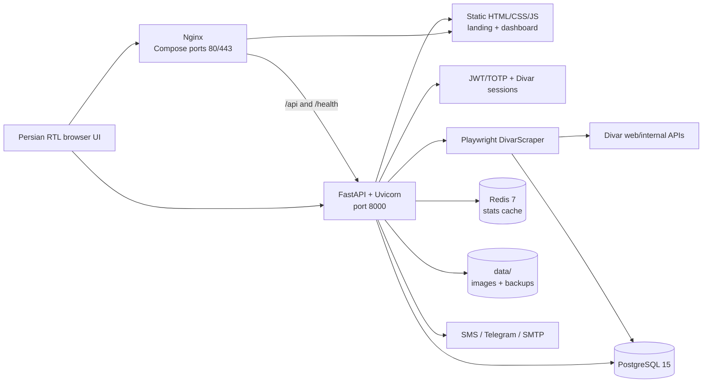
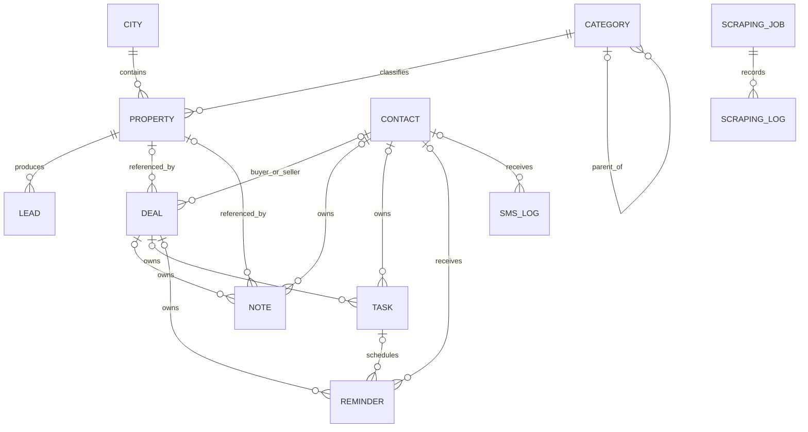
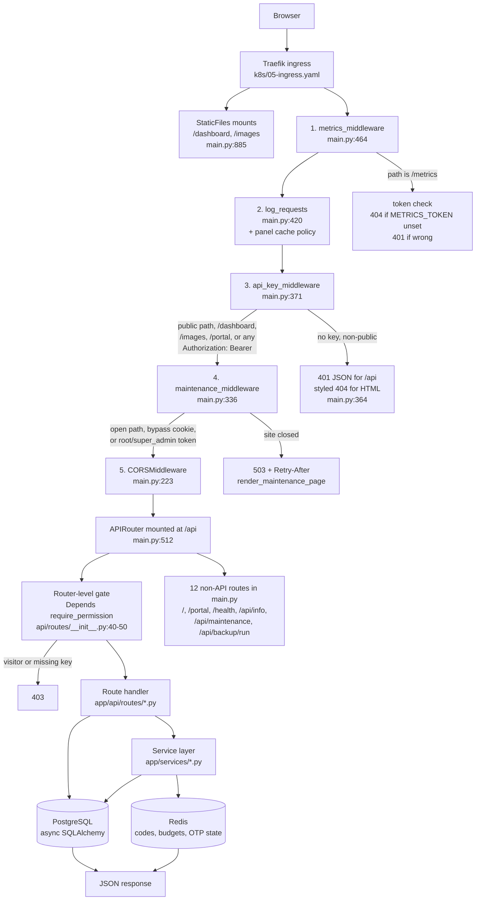
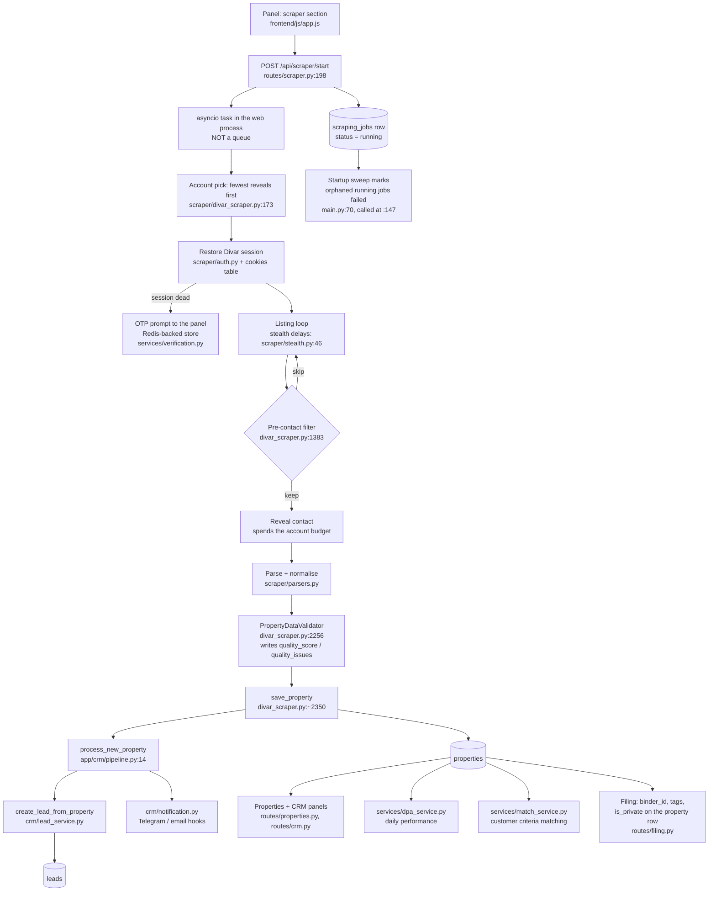

<div align="center">

# SorinFlow

**Divar property collection, data management, and real-estate CRM in one Persian RTL workspace.**

[](https://fastapi.tiangolo.com/)
[](https://playwright.dev/python/)
[](https://www.postgresql.org/)
[](LICENSE)

</div>

SorinFlow is a FastAPI application for collecting real-estate listings from Divar, managing the resulting property inventory, and moving new opportunities through a built-in CRM. It combines a Playwright scraper, PostgreSQL data model, Redis-backed analytics cache, role-aware dashboard, Divar session management, and a Kavenegar SMS panel and an SMTP email panel (each with its own router, permission key, encrypted credential store, templates and audience builder), and optional Telegram and Google Cloud integrations.

> [!CAUTION]
> This repository can process phone numbers, browser sessions, and other personal or confidential data. Use it only where you have permission and a lawful basis, respect Divar's terms and rate limits, and apply appropriate retention and access controls.

> [!IMPORTANT]
> Runtime secrets and session artifacts **were** once tracked here despite matching `.gitignore` rules. They have since been untracked and purged from history — nothing matching those patterns is tracked today. The rotation advice still stands, because purging history does not un-publish anything that was already cloned: treat any credential, cookie, or private key that was ever committed as compromised, and rotate or revoke it. On the Divar side that also means signing out unrecognised devices, which expiring a session file locally does not do.

**Navigate:** [Project brain](#project-brain) · [Architecture](#architecture) · [Quick start](#quick-start) · [API](#api-overview) · [Configuration](#configuration) · [Developer map](#developer-change-map) · [Operations](#operations)

## What the project includes

- **Divar collection:** configurable city/category jobs, exact-date and recency modes, price/area/room/amenity filters, advertiser filtering, duplicate updates, and single-listing collection.
- **Authenticated contact extraction:** separate Divar phone/OTP sessions, cookie import and refresh, per-user linked Divar numbers, and scrape-time OTP pause/resume.
- **Property inventory:** Persian-aware parsing, stable Divar IDs, human-facing tags, incremental serial numbers, local JPEG image storage, filtering, pagination, soft deletion, and JSON/CSV export.
- **CRM:** leads, contacts, structured customer profiles, tasks, deals, notes, reminders, SMS logs, lead notifications, reporting, and daily performance assessment (DPA).
- **Dashboard security:** username/password JWT login, optional TOTP, four roles (`root`, `super_admin`, `admin`, `visitor` — the first three reach the dashboard, the fourth is portal-only), an 11-key permission catalogue, and super-admin account management.
- **Operations:** PostgreSQL, Redis, Docker Compose, Nginx, health checks, nightly JSON backups, Kubernetes manifests, and a GitHub Actions deployment workflow.

## Project brain

Read this before changing anything. Where this section and the rest of the README disagree, this section is the one that was checked against the code.

**What it is.** One FastAPI process that scrapes Divar listings with Playwright, stores them as a property inventory, and works them through a CRM — plus a public customer portal bolted on the side. Persian/RTL throughout. It runs live at `sorinflow.com` on a single-node k3s cluster on an Iranian VPS behind Traefik. `main` is the only branch and pushing to it deploys to production, so the pytest gate in CI is the only pre-production environment that exists.

**Moving parts.**

| Part | Where | Notes |
|---|---|---|
| API | 14 routers mounted at `/api` (`app/api/routes/__init__.py:14-50`) | 189 application endpoints; CRM alone is 65 |
| Non-router routes | 12 defined in `app/main.py` | `/`, `/portal`, `/health`, `/api/maintenance`, `/api/public/stats`, the `/dashboard` and `/images` mounts |
| Data model | 20 tables across 8 modules under `app/models/` | created by `Base.metadata.create_all`, then patched |
| Frontend | three separate HTML documents, no build step | `index.html` (staff panel, 11 sections in one file), `portal.html` (visitor, zero CDN), `landing.html` |
| Services | 17 modules under `app/services/` | backups, SMS, email, verification, maintenance, matching, Excel, GCP |
| Background | 4 tasks + one boot-time cleanup, started in lifespan | reminders, backups, lease expiry, GCP exporter |

**Auth is two systems, not one.** Four roles (`root`, `super_admin`, `admin`, `visitor`) in `app/auth/permissions.py:17-32`. `root` and `super_admin` bypass permission checks; `admin` is filtered through an 11-key permission list stored as JSON on the user row; `visitor` is refused by `_staff_check` before the list is read. The gate that matters is `Depends(require_permission(k))` applied at the **router** level, so a handler that looks unguarded usually is not — check `app/api/routes/__init__.py` first. `visitor` accounts hold perfectly valid JWTs, so "authenticated" stopped meaning "belongs in the panel" the day the portal shipped.

**Migration lock discipline.** There is no Alembic. Schema patches are 17 hand-written idempotent steps listed in a tuple in `init_db()` (`app/database.py:103-128`). The rules, each of which was paid for:

- Every step runs in **its own** `engine.begin()`. One shared transaction meant a single failure poisoned the rest and the rollback undid `create_all` too.
- Every step runs `SET lock_timeout='5s'` and `statement_timeout='120s'` first (`_guard`, `app/database.py:150-166`).
- Query `information_schema` **before** issuing an `ALTER`. `ADD COLUMN IF NOT EXISTS` takes `ACCESS EXCLUSIVE` before checking whether there is work to do; a no-op ALTER queued behind the old pod's lock killed two rollouts (`app/database.py:664-694` names them).
- Exactly one step may stop the boot: `_verify_auth_v2` (`app/database.py:731-772`) refuses to start on a half-migrated `users` table, because those five columns are read on every User query.

Ordering is the tuple; idempotence is each step's own job. The two `.sql` files in `migrations/` are applied by nothing.

**Single replica, ReadWriteOnce, `strategy: Recreate`.** Three PVCs, all RWO, one backend pod (`k8s/04-backend.yaml:19-37`). Two overlapping pods would fight over the data volume and deadlock on migration locks, so deploys use `Recreate` — every deploy is a few seconds of real downtime, accepted deliberately. The consequence to keep in mind: a pod that fails startup is now a full outage, not a failed deploy that leaves the old pod serving. Comments in `app/database.py:740-742` and `SECRETS.md:245-248` still assume the old behaviour; they are wrong.

State that lives in the process, not the database, and therefore dies with the pod: running scrape tasks, Divar login sessions (`auth_instances`, `app/api/routes/auth.py:31`), and OTP suppression. `_release_orphaned_jobs` runs before anything can create a job, which is what makes it safe to fail every `running` row it finds (`app/main.py:70,147`).

**Verification channel semantics.** A signup code is delivered by whichever channel is available — `_deliver` prefers SMS only when Kavenegar has a key, otherwise email goes first (`app/services/verification.py:197-213`). With no provider credentials, that means **every code today travels by email**. The channel is written to Redis beside the code (`:143`) and returned by `verify_code` (`:216-260`), and only that channel is credited: `phone_verified` for SMS, `email_verified` for email (`app/api/routes/public_auth.py:279-282`). They are separate columns (`app/models/user.py:36-41`) because collapsing them puts a "verified phone" tick next to a number nobody has ever answered — and `phone_verified` is what the SMS marketing audience reads as consent (`app/api/routes/sms.py:252-256`). Those SMS audiences therefore read zero, which is the honest count.

**Fail-soft legs, on purpose.** Per-IP throttling (5 signups, 10 codes per hour) and login rate limiting both **fail open** when Redis is down — a blip degrades sign-up rather than locking the office out of a live panel (`app/services/verification.py:300-322, 340-352`). Budgets are spent only after the send succeeds. `client_ip` takes the **rightmost** `X-Forwarded-For` entry because Traefik appends the real peer; taking the leftmost would let anyone reset their own budget with a forged header (`:277-295`). `secret_box.decrypt()` returns `""` instead of raising, and its Fernet key is derived from `SECRET_KEY` — rotating that key silently invalidates every panel-saved credential and the only symptom is a warning line.

**Other rules that are not obvious from the code they govern.**

- Middleware runs metrics → log → api_key → maintenance → routes (registration order in `app/main.py` is reversed). `/metrics` is not a route at all; it is served from inside the metrics middleware, which is why an unset `METRICS_TOKEN` gives 404, not 401.
- Any `Authorization: Bearer` header bypasses the API key entirely (`app/main.py:349-350`). The key gates unauthenticated paths only.
- Maintenance mode lives in `app_settings`, not memory, so a pod replacement cannot quietly reopen a closed site. Panel credentials live there too, Fernet-encrypted; environment variables always win over them.
- Credentials resolve env-first, panel-second (`app/services/sms_service.py:160-174`, `email_service.py:117-164`).
- Logs pass a redaction filter on both sinks and loguru `diagnose` is off — with it on, a connection error prints `DATABASE_URL` and its password into a file at rest on the node.
- The frontend has no module system: ~150 inline `onclick=` handlers call globals in one 8.9k-line `app.js`. `tests/test_frontend_wiring.py` parses both files to prove nothing was deleted out from under a handler; that static parse is the entire frontend safety net.

**What will bite you.**

- **README elsewhere is stale.** It says CI does not run pytest (it does, and it has blocked a deploy), lists 9 permission keys (there are 11), calls public sign-up off by default (the cluster sets `PUBLIC_AUTH_ENABLED="true"`), and links a `graphify-out/` directory that is git-ignored and absent. `local/start.sh`, the documented dev entry point, is also git-ignored.
- **CI applies only two manifests** — `04-backend.yaml` and `05-ingress.yaml`. Namespace, Postgres, Redis and the Traefik ACME config drift silently.
- **A Secret key with no matching `env` entry in `04-backend.yaml` never reaches the pod**, so `kubectl patch secret` for it is a silent no-op. `LLM_API_KEY`, `SUPER_ADMIN_PASSWORD` and the `GCP_*` block are in that state today.
- **The nightly backup is unfiltered**: every table, including plaintext `users.totp_secret`, password hashes, and live Divar session JSON, gzipped and uploaded to Telegram (`app/services/backup_service.py:44-90`). There is no exclusion list and no off switch. Meanwhile `scripts/restore_backup.py` registers only 7 of the 11 model modules, so a restore silently drops `app_settings`, both portal tables and `email_logs`.
- **Tests skip quietly on SQLite.** A local run is 739 passed / 31 skipped; the 22 skipped in `tests/test_auth_roles.py` are the behavioural role and permission attacks. CI supplies real Postgres and Redis. House rule, stated by the owner: leave a test that fails without the fix, and revert it once to watch it go red.
- **Untested surface is the request layer.** No test imports any route module; `app/api/routes/crm.py` alone is 2,177 lines. 28 handlers take a raw `dict` body with no schema.
- The panel loads nine assets from jsDelivr and code.jquery.com with no fallback, while byte-real local copies of four of them sit unreferenced in `frontend/`. On an Iranian network that is the panel's most exposed dependency.
- `SCRAPER_DELAY_MIN`/`MAX` are published in `.env.example` and read by nothing; the real delay is hardcoded to 0.35–0.9s in `app/scraper/stealth.py:46-47`.
- `_maintenance_allows` is defined twice, byte-identical, in `app/main.py` (lines 258 and 297). Edits to the first one do nothing.
- `root` is documented as unrestricted but is silently filtered like an admin on the CRM task board (`crm.py:1297`) and on private files (`filing.py:64-66`).

## Architecture



### Scrape-to-CRM lifecycle

1. A user signs in to SorinFlow and starts a job through `POST /api/scraper/start`.
2. FastAPI validates the city/category, enforces a maximum of three database-tracked running jobs, creates a job record, and starts an in-process background task.
3. `DivarScraper` restores the selected Divar session, discovers listings through browser traffic and page markup, and opens each detail page.
4. Parsers normalize Persian/Arabic digits and extract pricing, location, area, rooms, features, amenities, advertiser details, publication time, phone number, and images.
5. Filters and validation run before the property is inserted or updated in PostgreSQL. Images are converted to JPEG and saved under `data/images/`.
6. Every newly inserted property creates one CRM lead. Configured Telegram and SMTP notifications are attempted without failing the scrape if delivery is unavailable.
7. The dashboard polls job progress, pending OTP requests, properties, CRM records, and cached statistics.

Redis is used for dashboard/public-stat caching and health checks. It is **not** a Celery broker, and scrape jobs are not durable queue jobs.

### Core data model



`User`, `Cookie`, `Customer`, and `DailyPerformance` are separate aggregates rather than foreign-key children in this graph. Users and scraping jobs are associated with a Divar phone value, but that association is not enforced by a database foreign key.

## System design map

This section answers "where do I change X?" without reading the codebase. Every path below is a real file, and the line numbers were current at the time of writing — if one has drifted, the surrounding function name still holds.

### 1. A request's path

Starlette runs the **last-registered** middleware first, so the registration order in `app/main.py` is the reverse of the runtime order. The chain below is the runtime order.



Two consequences worth knowing before you touch the chain:

- **Any** `Authorization: Bearer …` header satisfies `api_key_middleware` (`main.py:349`), so `API_KEY` gates unauthenticated non-public paths only — it is not a second factor for logged-in callers.
- `maintenance_middleware` is the innermost of the four, and it fails **open** if its own check raises (`main.py:296-299`). A browser hitting `/dashboard` sends no bearer header, so the practical way in during a closure is the `/maintenance-access` bypass cookie, not the JWT branch.

### 2. Scrape to CRM lifecycle



The scrape lives inside the web process, which is why `strategy: Recreate` (`k8s/04-backend.yaml:36`) plus the orphan sweep exist: a deploy kills the task, and without the sweep the row says «در حال اجرا» forever.

### 3. Sign-up and verification

The channel that actually carried the code is recorded, and only that channel is credited. With no Kavenegar credentials configured, that means every code today travels by **email** and `phone_verified` stays false.

```mermaid
sequenceDiagram
    participant V as "Visitor (portal.html)"
    participant A as "routes/public_auth.py"
    participant Th as "services/verification.py"
    participant R as "Redis"
    participant S as "sms_service / email_service"
    participant DB as "PostgreSQL"

    V->>A: "POST /api/public/auth/register"
    A->>Th: "check_ip_budget (5 signups/hr)"
    Note over Th: "client IP = RIGHTMOST X-Forwarded-For<br/>Traefik appends the real peer"
    A->>DB: "upsert user, role = visitor"
    A->>Th: "issue_code(PURPOSE_SIGNUP)"
    Th->>S: "_deliver: SMS first only if<br/>KAVENEGAR_API_KEY is set,<br/>else email first"
    S-->>Th: "channel that succeeded"
    Th->>R: "store code + channel + ttl"
    A-->>V: "message names the real channel"

    V->>A: "POST /api/public/auth/verify"
    A->>Th: "verify_code -> returns channel"
    alt "channel == sms"
        A->>DB: "phone_verified = True"
        Note right of DB: "proves the NUMBER answers.<br/>SMS marketing audience reads this"
    else "channel == email"
        A->>DB: "email_verified = True"
        Note right of DB: "proves the ADDRESS answers.<br/>Email audience reads this"
    end
    A->>S: "welcome email, first verification only"
    A-->>V: "access token (visitor)"

    V->>A: "POST /api/public/auth/login"
    Note over A: "either proof is enough;<br/>staff accounts are refused here<br/>so this cannot bypass TOTP"
```

`GET /api/public/auth/status` is the one endpoint in this router with no `PUBLIC_AUTH_ENABLED` gate — the login page, the landing page and the portal all read it to decide whether to show sign-up.

### 4. Where to change what

| Task | Open these | What else must change |
|---|---|---|
| **Add an API endpoint** | The router in `app/api/routes/`; `app/schemas/__init__.py` for the request/response model | Nothing to mount if the router already exists — the router-level `Depends(require_permission(...))` in `app/api/routes/__init__.py:40-50` covers it. New router: add the `include_router` line **and** a permission key. Frontend: add the `apiCall` in `frontend/js/app.js`. If it must answer without a token, add the path to `public_paths` in `app/main.py:328-342`, otherwise `API_KEY` rejects it before the handler. |
| **Add a database column** | The model in `app/models/` | **Migration required, by hand.** There is no Alembic environment. Add an idempotent async step in `app/database.py` and register it in the tuple at `:103-119`. Check `information_schema` **before** the `ALTER` (pattern at `:664-690`) — a no-op `ADD COLUMN IF NOT EXISTS` still takes `ACCESS EXCLUSIVE` and has killed two deploys. If the column is read on every `User` query, add it to `_verify_auth_v2` (`:731-772`). Add a case to `tests/test_pg_migration.py`, which CI runs against real Postgres. Add it to the `to_dict()` if the model has one. |
| **Add a panel page (section)** | `frontend/index.html` — a `#section-<name>` div plus a `nav-link-<name>` entry; `frontend/js/app.js` — the loader and the `showSection` switch | Add the section to `NAV_PERMISSION` and `SECTION_PERMISSION` (`app.js:614-633`) **and** to `ROUTE_SECTIONS` (`app.js:548`) or the hash route will be write-only. Add the matching permission key (row below). Add the inline `onclick` handlers to `tests/test_frontend_wiring.py`'s expectations — it parses both files and fails on a missing function. |
| **Add a scraper filter** | `app/scraper/divar_scraper.py` (the listing loop and the pre-contact skip at `:1383`); `app/scraper/parsers.py` for anything derived from listing text | Add the field to `ScrapingJobConfig` in `app/schemas/`, to the scraper form in `frontend/index.html`, and to the job payload in `app.js`. If it is persisted on the job, that is a column — see the migration row. Timing knobs live in `app/scraper/stealth.py:46-47`, **not** in `app/config.py` (`SCRAPER_DELAY_MIN/MAX` are read by nothing). |
| **Change a role or permission** | `app/auth/permissions.py:37-49` (the key → Persian label dict) and one `_perm("key")` line in `app/api/routes/__init__.py` | Keys deliberately match router names — a dict entry plus a gate is the whole backend job. Frontend: `NAV_PERMISSION`/`SECTION_PERMISSION` in `app.js:614-633`. Existing accounts do not gain a new key automatically; either add it to `DEFAULT_ADMIN_PERMISSIONS` (`permissions.py:54`) or backfill in a migration. Role tiers themselves (`STAFF_ROLES`, `FULL_ACCESS_ROLES`, `ASSIGNABLE_BY_SUPER_ADMIN`) are at `permissions.py:17-32`; `require_permission` and `_staff_check` are at `app/auth/dependencies.py:86-117`. |
| **Add a notification template** | Email: `app/services/email_templates.py`, then reference it from the caller (`routes/portal.py`, `routes/public_auth.py`, `services/verification.py`). SMS: `app/services/sms_service.py` | Email templates are listed by `GET /api/email/templates` and previewed by `/api/email/preview/{name}` — a new one shows up in the panel automatically. Kavenegar template names are stored in `app_settings`, not env: `KEY_OTP_TEMPLATE` in `sms_service.py:58`, edited from the SMS settings screen. Note `send_verify()` (`sms_service.py:260`) has no callers — codes currently go out over `send_sms()`. |
| **Change or add a secret** | `.env.example` (name and comment, **no value**); `app/config.py` (the `Field(..., env="NAME")`); `k8s/04-backend.yaml` (an `env:` entry with a `secretKeyRef`, `optional: true` unless the pod must not boot without it) | **All three, or it silently does nothing.** A key added to the Kubernetes Secret with no matching `env:` entry never reaches the process, so `kubectl patch secret` is a no-op — this is exactly how eleven keys sat dead for weeks. Panel-saved credentials (SMTP password, Kavenegar key) are Fernet-encrypted under a key derived from `SECRET_KEY` (`app/services/secret_box.py:25-28`): rotating `SECRET_KEY` makes them unreadable and they must be re-entered. Env always wins over the panel value. |
| **Add a background task** | `app/main.py` lifespan (`:147-180`) | Create the task **and** cancel it in the shutdown block. Insert it outside the `@asynccontextmanager` / `async def lifespan` pair — putting a helper between the decorator and the function detaches the decorator and the app fails to start. |
| **Change what the maintenance page lets through** | `app/services/maintenance.py:186-199` (`OPEN_PREFIXES`) and `app/main.py:297-334` (`_maintenance_allows`) | `_maintenance_allows` is currently **defined twice**, byte-identical, at `main.py:258` and `:297`. The second wins; edit that one. |

### 5. Module boundary rules

Enforced by convention today, not by a linter. The arrows below are the ones that actually exist in the tree.

```
app/api/routes/  →  may import anything below it
app/auth/        →  app/models/user, app/config, app/database
app/services/    →  app/models, app/config, app/database, other services
app/crm/         →  app/models, app/config, other app/crm modules
app/scraper/     →  app/models, app/config, app/services/dpa_service, app/crm/pipeline
app/models/      →  app/database, other models
```

Rules:

- **Nothing imports `app/api/routes/`** except `app/api/routes/__init__.py` and `app/main.py`. A service that needs route logic means the logic is in the wrong file.
- **`app/services/` must not import `app/scraper/`.** The scraper depends on services, never the reverse; the one direction is what keeps a Playwright import out of the request path.
- **`app/auth/` imports only `app/models/user`, `app/config` and `app/database`.** It must not reach into services — a circular import there breaks every route at boot.
- **`app/models/` should import only `app/database` and other models.** There is exactly one live exception: `app/models/crm_models.py:535` imports `to_jalali` from `app/services/dpa_service` inside a function body. Keep any such import function-local so module import order stays acyclic.
- **`app/scraper/` reaches forward into CRM through one door:** `process_new_property` in `app/crm/pipeline.py`, called at `divar_scraper.py:2355` inside a try/except that treats CRM failure as non-fatal. Add new post-save work there, not in `save_property`.
- **The frontend is three independent documents**, not one app: `index.html` + `js/app.js` (staff panel), `portal.html` + `js/portal.js` (visitors, deliberately zero CDN dependencies), `landing.html`. They share no JavaScript and use different token keys (`sf_token` vs `sf_portal_token`). Do not import one into the other — copy the four-line helper instead.
- **Heavy or optional imports go inside the function**, never at module scope, and never in a default argument. A guarded `import cv2` was once defeated by `cv2.TM_CCOEFF_NORMED` sitting in a method signature — defaults evaluate at class creation, and the whole application failed to import.

## Technology stack

| Layer | Technology |
|---|---|
| API | FastAPI 0.109, Uvicorn 0.27, Pydantic 2.5 |
| Persistence | PostgreSQL 15, SQLAlchemy async 2.0, asyncpg |
| Cache | Redis 7 |
| Collection | Playwright 1.41, Beautiful Soup 4.12, HTTPX, aiohttp |
| Media/data | Pillow, OpenCV, NumPy, openpyxl |
| Authentication | JWT/HS256, bcrypt, optional TOTP via PyOTP |
| Frontend | Static HTML, CSS, and JavaScript; Bootstrap RTL and Chart.js |
| Operations | Docker Compose, Nginx, k3s/Kubernetes, GitHub Actions |
| Tests | pytest and pytest-asyncio |

The source uses Python 3.10+ syntax. No authoritative Python version file is checked in, so Docker is the canonical runtime.

## Quick start

### Local development — the short way

No Docker needed. `./local/start.sh` brings up PostgreSQL, Redis and the API,
creates the database on first run, and prints the logins:

```bash
./local/start.sh          # http://127.0.0.1:8010
./local/stop.sh           # stops all three, keeps your data
```

It is idempotent and safe to re-run. Local values live in `local/local.env`,
which git ignores and which never shares credentials with production — real
environment variables take precedence over `.env`, so a local run cannot pick
up a production value by accident.

Set `AUTH_SMS_PROVIDER=console` to have portal verification codes written to the
log instead of sent by SMS (refused when `ENVIRONMENT=production`):

```bash
grep sms:console local/server.log | tail -1
```

### Requirements for the Docker path

- Git
- Docker Engine or Docker Desktop
- Docker Compose v2 (`docker compose`)
- Network access to Divar and the frontend's CDN dependencies

### 1. Clone and configure

```bash
git clone https://github.com/Tecso-Dev/SorinFlow-DaTA-mAmager.git
cd SorinFlow-DaTA-mAmager

# Replace the local configuration with the documented template.
cp .env.example .env
```

Review `.env` before starting. At minimum, replace the default database, Redis, and application secrets:

```env
POSTGRES_USER=sorinflow
POSTGRES_PASSWORD=replace-with-a-strong-password
POSTGRES_DB=divar_scraper

REDIS_PASSWORD=replace-with-a-strong-password
SECRET_KEY=replace-with-a-long-random-value

# Optional supplemental middleware key; JWT remains the primary API auth.
API_KEY=

# Leave disabled until intentionally configured.
PROXY_ENABLED=false
PROXY_LIST=
DIVAR_PHONE_NUMBER=
```

Generate a secret with:

```bash
openssl rand -hex 32
```

Never commit the resulting `.env`.

### 2. Start the stack

```bash
docker compose up -d --build
docker compose ps
```

The [`start.sh`](start.sh) wrapper can also create directories, rebuild without cache, start the stack, and perform basic health checks:

```bash
./start.sh
```

### 3. Open the application

| Service | URL | Notes |
|---|---|---|
| Dashboard (recommended locally) | <http://localhost:8000/dashboard/> | Direct FastAPI route; keep the trailing slash |
| API documentation | <http://localhost:8000/api/docs> | Swagger UI |
| ReDoc | <http://localhost:8000/api/redoc> | Alternative API reference |
| Health check | <http://localhost:8000/health> | Backend liveness |
| Backend landing page | <http://localhost:8000/> | Public marketing page |
| Nginx dashboard | <http://localhost/> | Compose serves `frontend/index.html` at `/` |

Use the direct backend dashboard during local development because the bundled Nginx configuration does not currently proxy the generated `/images/...` URLs.

On an empty database, SorinFlow seeds this super-admin account:

```text
Username: admin
Password: whatever you set in SUPER_ADMIN_PASSWORD (there is no default)
```

Change it immediately from the user-management screen. Bootstrap credentials are only read when the users table is empty; changing environment variables later does not update an existing account.

### 4. First-use workflow

1. Sign in to the SorinFlow dashboard.
2. Reset the seeded super-admin password and create any additional accounts.
3. Open **Divar Authentication**, enter a Divar phone number, and complete OTP verification or import an existing cookie set.
4. Open **Scraper**, choose a city and category, set filters, and start a job.
5. Monitor progress under scraper jobs, review the property inventory, and manage automatically created leads in CRM.

## Authentication model

Three separate authentication paths:

| Path | Who | Main endpoints |
|---|---|---|
| Dashboard | staff — `root`, `super_admin`, `admin` | `/api/users/token`, `/api/users/token/verify-totp`, `/api/users/me` |
| Customer portal | `visitor`, public sign-up by SMS | `/api/public/auth/register`, `/verify`, `/login` |
| Divar session | the scraper's own browser session for contact extraction | `/api/auth/login`, `/api/auth/verify`, `/api/auth/cookies` |

Dashboard JWTs last 24 hours and carry a `typ` claim. Only a finished access
token authenticates: the half-token issued between password and TOTP is
refused, so the second factor cannot be skipped.

### Roles

| Role | What it is |
|---|---|
| `root` | The developer. Everything, always. Seeded from `ROOT_PASSWORD`, never creatable from the panel, hidden from the super admin's user list, and protected from being edited, deleted or password-reset by anyone but another root. |
| `super_admin` | The agency owner. Runs the business — staff, permissions, upgrade tickets, visitor requests. Cannot create or become a root. |
| `admin` | An employee. Reaches only the areas ticked in `users.permissions`. |
| `visitor` | A public sign-up. No dashboard at all — the portal only. |

`root` and `super_admin` bypass permission checks; a permission list is only
ever consulted for an `admin`. Permission keys are defined in
[`app/auth/permissions.py`](app/auth/permissions.py) and gate the routers in
[`app/api/routes/__init__.py`](app/api/routes/__init__.py): `properties`,
`scraper`, `crm`, `filing`, `divar_auth`, `proxies`, `stats`, `portal`,
`sms`, `email`,
`monitoring`.

Enforcement is server-side at the router, not just hidden in the UI — the panel
builds its navigation from the permissions `/api/users/me` reports, so the menu
and the API cannot disagree.

### Public sign-up

**On in production.** The code default and `.env.example` still say
`PUBLIC_AUTH_ENABLED=false`, but the deployed manifest sets it to `"true"`, so
sign-up is open at sorinflow.com. While it is off, `/portal` redirects to the
dashboard and four of the five `/api/public/auth/*` endpoints answer 404 —
`GET /status` is the exception and always answers, because the login page reads
it to decide whether to show the sign-up tab at all.

A visitor registers with **both** a phone number and an email address, both
mandatory, and receives a verification code. Which channel carries that code is
decided at send time: `_deliver` prefers SMS only when Kavenegar has a key, and
otherwise sends by email with SMS as the fallback. With no provider credentials
configured — the current state — **every code travels by email**.

Only the channel that actually carried the code is credited. `phone_verified`
and `email_verified` are separate columns, because a code read out of an inbox
proves the address and says nothing about the number: collapsing them put a
verified-phone tick beside numbers nobody had ever answered, and the SMS
marketing audience reads that flag as consent to text. Either proof signs the
visitor in. The SMS audiences therefore report zero until Kavenegar is live,
which is the honest count.

A verified visitor can describe the property they are looking for — which lands
in the panel's «درخواست‌های مشتریان» screen for staff to call — and can request
an upgrade to `admin`, which a super admin approves with a chosen set of
permissions. Sign-up is throttled per IP (5 registrations and 10 codes per hour)
on top of the per-phone budgets, keyed on the **rightmost** `X-Forwarded-For`
entry because Traefik appends the real peer.

`API_KEY` is supplemental middleware, not a replacement for JWT. It is a
separate value from `METRICS_TOKEN`, which guards `/metrics` alone so a
monitoring scraper never needs the key that opens the rest of the API.

## API overview

All application routes are mounted below `/api`.

| Prefix | Responsibility |
|---|---|
| `/api/users` | Dashboard login, TOTP, profile, and user administration |
| `/api/auth` | Divar OTP and cookie/session management |
| `/api/scraper` | Jobs, filters, single-URL collection, and scrape-time OTP |
| `/api/properties` | Property search, detail, update, soft deletion, and export |
| `/api/crm` | Leads, contacts, customers, tasks, deals, notes, reminders, SMS, DPA, reports — 65 endpoints, the largest router |
| `/api/filing` | Cabinets and folders (کمد و زونکن), including private ones |
| `/api/proxies` | Proxy CRUD, import, activation, connectivity tests, and bulk removal |
| `/api/stats` | Dashboard totals, health, logs, job summaries, and trends |
| `/api/monitoring` | Service health, resource use, live logs, Divar connectivity probe, and session verification. Also gates `/api/gcp` |
| `/api/sms` | Kavenegar panel: settings, audiences, broadcast, delivery status, logs |
| `/api/email` | SMTP panel: settings, templates, previews, audiences, broadcast, export |
| `/api/portal` | Visitor requests and upgrade tickets, plus the staff screens that triage them |
| `/api/public/auth` | Visitor sign-up, resend, verify, login — unauthenticated, per-IP throttled |
| `/api/gcp` | Google Cloud export controls |
| `/api/public/stats` | Public cached landing-page statistics |
| `/api/maintenance` | Maintenance-mode status and switch |
| `/api/backup/run` | Manual super-admin backup |

### Obtain a dashboard token

The login endpoint expects OAuth form data, not JSON:

```bash
curl -X POST http://localhost:8000/api/users/token \
  -H "Content-Type: application/x-www-form-urlencoded" \
  -d "username=admin&password=YOUR_PASSWORD"
```

Copy `access_token` from the response:

```bash
export SORINFLOW_TOKEN="YOUR_ACCESS_TOKEN"
```

### Start a scrape

```bash
curl -X POST http://localhost:8000/api/scraper/start \
  -H "Authorization: Bearer $SORINFLOW_TOKEN" \
  -H "Content-Type: application/json" \
  -d '{
    "city": "tehran",
    "category": "buy-apartment",
    "max_items": 20,
    "download_images": true,
    "min_area": 80,
    "has_parking": true
  }'
```

Use `GET /api/scraper/cities` and `GET /api/scraper/categories` to discover supported slugs. Additional job filters include sale price, deposit, monthly rent, price per square meter, room count, images, elevator, storage, balcony, advertiser type, maximum listing age, and exact Gregorian publication date.

### Divar phone login

```http
POST /api/auth/login
Authorization: Bearer <token>
Content-Type: application/json

{"phone_number":"09123456789"}
```

Then submit the received code:

```http
POST /api/auth/verify?phone_number=09123456789
Authorization: Bearer <token>
Content-Type: application/json

{"code":"123456"}
```

## Configuration

Application settings live in [`app/config.py`](app/config.py). `.env.example` covers the common local values, but not every supported setting.

| Area | Variables |
|---|---|
| Core | `ENVIRONMENT`, `DEBUG`, `SECRET_KEY`, `API_KEY`, `CORS_ORIGINS` |
| Database | `POSTGRES_USER`, `POSTGRES_PASSWORD`, `POSTGRES_DB`, `DATABASE_URL` |
| Redis | `REDIS_PASSWORD`, `REDIS_URL` |
| Bootstrap admin | `SUPER_ADMIN_USERNAME`, `SUPER_ADMIN_PASSWORD` |
| Scraper | `SCRAPER_HEADLESS`, `SCRAPER_TIMEOUT`, `SCRAPER_DELAY_MIN`, `SCRAPER_DELAY_MAX`, `OTP_WAIT_TIMEOUT`, `DIVAR_PHONE_NUMBER` |
| Proxies | `PROXY_ENABLED`, `PROXY_LIST` |
| SMS | `KAVENEGAR_API_KEY`, `KAVENEGAR_SENDER`, `MELIPAYAMAK_API_KEY`, `MELIPAYAMAK_FROM` |
| Telegram | `TELEGRAM_BOT_TOKEN`, `TELEGRAM_CHAT_ID` |
| Email | `SMTP_HOST`, `SMTP_PORT`, `SMTP_USER`, `SMTP_PASSWORD`, `NOTIFICATION_EMAIL` |

### Docker Compose environment caveat

Compose uses `.env` for variable interpolation, but only variables explicitly listed under `services.backend.environment` are passed into the container. The checked-in Compose file forwards the core database, Redis, secret, API-key, environment, and proxy values; several optional integration and scraper variables are not forwarded.

To pass the complete local `.env` to the backend, add this to a local Compose override:

```yaml
services:
  backend:
    env_file:
      - .env
```

Explicit entries in `docker-compose.yml` continue to take precedence over values from `env_file`.

## Secrets and server configuration

**This repository is public.** A value written into a tracked file is published
the moment it is pushed, and stays readable in the history even after the line
is deleted. Full guide, including how to add a variable and how to rotate one
without downtime: **[SECRETS.md](SECRETS.md)**.

The short version:

| Kind of value | Where it belongs | Committed? |
|---|---|---|
| Passwords, API keys, tokens, `SECRET_KEY` | Kubernetes Secret `sorinflow-secrets` | **never** |
| TLS certificate and private key | Traefik's ACME store on the server | **never** |
| Divar session cookies | the `data-pvc` volume (`/app/data/cookies`) | **never** |
| Which variables exist, and what they mean | `.env.example` — names and comments only | yes |
| Non-secret settings (timeouts, limits, flags) | `k8s/04-backend.yaml` as plain `env:` | yes |
| Local development values | `local/local.env` — git-ignored | **never** |

Adding a new secret is four steps — declare the name in `.env.example`, read it
in `app/config.py` with an **empty** default, put the real value in the cluster
with `kubectl patch secret`, then reference it from `k8s/04-backend.yaml` via
`secretKeyRef`. Never default a setting to a working credential: a real-looking
fallback makes a misconfigured deploy look healthy instead of failing loudly.

⚠️ **`POSTGRES_PASSWORD` is the one that can take the site down.** It is stored
inside the database on its volume, so changing only the Kubernetes Secret leaves
the app presenting a password the database has never seen. It must be changed
with `ALTER USER` first — the ordered runbook is in
[SECRETS.md §4c](SECRETS.md).

If a secret is ever committed again: **rotate it first**, then purge the
history, then add it to `.gitignore`, then find the process that put it there. A
leak is usually a process rather than an accident — `renew-ssl.sh` used to copy
the TLS private key into `nginx/ssl/` on every renewal, so it reappeared no
matter how often the file was deleted.

## Monitoring and observability

Everything is computed on the box. Nothing leaves the server, which is the only
design that works from Iran and also the cheapest.

| Surface | What it gives you |
|---|---|
| **پایش سامانه** (panel) | Postgres and Redis latency, disk usage, uptime, memory, scraper jobs by status, stale-job detection, live log viewer with level and text filters, Google Cloud status |
| `GET /metrics` | Prometheus text — HTTP rate and latency by route group, scraper counters (contact reveals, rotations by reason, OTP challenges, image outcomes), process CPU/memory, disk. Guarded by `METRICS_TOKEN`; empty disables it and the path 404s |
| `GET /api/monitoring/overview` | The same health data as JSON, for the panel |
| `GET /api/stats/logs` | Windowed reverse scan over the rotating log, filterable by level and text |

Logs are written through a redaction filter on **both** sinks
([`app/log_redaction.py`](app/log_redaction.py)) — Iranian mobile numbers in
ASCII and Persian digits, URL credentials, JWTs and bearer tokens are masked
before anything reaches stdout or disk. Container stdout is persisted to the
node by containerd, so a log line is at rest on the server.

### Google Cloud

[`app/services/gcp/`](app/services/gcp/) exports to Cloud Logging (structured
`jsonPayload`), Cloud Monitoring (custom time series), and optionally Pub/Sub,
and reads platform metrics for Compute Engine, Cloud Run, Cloud Functions and
Cloud SQL. REST over `httpx` with a service-account JWT rather than the SDKs,
which would add over a hundred megabytes to an image that already carries
Chromium.

**Ships disabled** (`GCP_ENABLED=false`). Google's endpoints are not reachable
from an Iranian IP, so it is useful behind a VPN, after a migration, or pointed
at a client's project. It fails soft by design: a bounded buffer that drops
oldest rather than growing, backoff on repeated failure, and
`/api/gcp/status` distinguishing *disabled* from *unconfigured* from
*unreachable*. No request path or scrape ever waits on Google.

## Public pages

`/`, the maintenance page, 404 and 500 share one design system
([`app/error_pages.py`](app/error_pages.py)) — the landing page's palette,
gradient and infinity mark. Self-contained: no CDN stylesheet, no webfont
request, no external script, because two of them exist precisely when something
is already broken.

Error responses negotiate: anything under `/api` returns JSON, everything else
follows `Accept`, so a browser gets a page and a script still gets something
parseable. The 500 page carries a reference id that is also in the log.

Maintenance mode is stored in the database, so it survives deploys and pod
restarts. It supports a countdown, emergency contact details, and a bypass link
for whoever is allowed through — all editable from the panel while the site is
closed.

## Repository map

| Path | Purpose |
|---|---|
| `app/main.py` | FastAPI application, middleware, public routes, static mounts, and lifespan jobs |
| `app/api/routes/` | User, Divar auth, scraper, property, CRM, proxy, and statistics endpoints |
| `app/auth/` | JWT/password helpers and authenticated-user dependencies |
| `app/scraper/` | Browser automation, parsing, validation, contact extraction, OTP state, and images |
| `app/crm/` | Automatic lead creation and notification pipeline |
| `app/models/` | SQLAlchemy models for core and CRM data |
| `app/services/` | Backups, SMS providers, and DPA support |
| `frontend/` | Persian landing page and static single-page dashboard |
| `tests/` | Parser, validator, captcha, settings, and auth unit tests |
| `scripts/` | Server provisioning, deployment, survey, and backup restoration helpers |
| `k8s/` | k3s/Kubernetes resources for backend, PostgreSQL, Redis, ingress, and Traefik |
| `nginx/` | Local reverse proxy and TLS configuration |
| `migrations/` | Standalone legacy SQL patches |
| `graphify-out/` | Generated project brain and machine-readable graph |

### Key entry points

- **Application lifecycle:** `app/main.py` creates FastAPI, installs middleware, mounts static files, and starts reminder, lease-expiry, and backup schedulers.
- **API composition:** `app/api/routes/__init__.py` mounts every domain router and applies shared JWT dependencies.
- **Scrape orchestration:** `app/api/routes/scraper.py` creates jobs; `DivarScraper.start_scraping_job()` in `app/scraper/divar_scraper.py` performs collection and persistence.
- **Property-to-CRM bridge:** `app/crm/pipeline.py` creates a lead and dispatches configured notifications after a new property is saved.
- **Database startup:** `app/database.py` creates tables, applies idempotent patches, and seeds the first super admin.
- **Dashboard:** `frontend/index.html` contains the UI shell and forms; `frontend/js/app.js` owns routing, API calls, state, and rendering.
- **Production delivery:** `Dockerfile`, `docker-compose.yml`, `k8s/`, and `.github/workflows/deploy.yml`.

## Developer change map

| I want to... | Start here | Also verify |
|---|---|---|
| Add a property field | `app/models/property.py` | Schemas, parsers, `DivarScraper`, API output, dashboard rendering, initialization/migration |
| Add a scraper filter | `ScrapingJobCreate` in `app/schemas/__init__.py` | Scraper route pass-through, `start_scraping_job()`, frontend form and request payload |
| Change listing parsing | `app/scraper/parsers.py` and `app/scraper/divar_scraper.py` | Validator behavior and `tests/test_parsers.py` |
| Add an API domain or endpoint | Matching module in `app/api/routes/` | Router inclusion, JWT/role dependency, schema, frontend caller, API docs |
| Add or change a CRM entity | `app/models/crm_models.py` and `app/api/routes/crm.py` | Foreign keys, exports, dashboard tab/forms, DPA side effects |
| Change dashboard permissions | `app/auth/dependencies.py` and `app/api/routes/users.py` | `applyRoleUI()` and section routing in `frontend/js/app.js` |
| Add a setting | `app/config.py` | `.env.example`, Compose forwarding, Kubernetes secrets/environment, README configuration table |
| Change database structure | SQLAlchemy model | `init.sql`, startup patches or a migration, restore compatibility, tests |
| Change deployment | `docker-compose.yml` or `k8s/` | Health checks, volumes, ingress, secrets, and GitHub Actions |
| Assess change impact | `graphify affected "<symbol>" --depth 2` | Interactive project brain and call-flow report |

### Existing conventions

- Python files and functions use `snake_case`; classes and Pydantic/SQLAlchemy models use `PascalCase`.
- I/O paths are asynchronous. Routes receive `AsyncSession` through FastAPI dependencies, while scrape jobs create an isolated engine/session.
- Route handlers raise `HTTPException`; scraper and integration failures are logged with Loguru, with non-critical CRM notification failures kept non-fatal.
- API schemas are centralized in `app/schemas/__init__.py`; database models are separated by domain under `app/models/`.
- The frontend is a build-free JavaScript application using global `camelCase` functions, DOM IDs, and same-origin `/api` calls.
- Tests follow `tests/test_*.py`, pytest classes, and `test_*` functions.
- Recent history follows scoped Conventional Commit-style subjects such as `feat(properties):`, `fix(crm):`, and `perf(scraper):`.

## Development

### Tests

```bash
DATABASE_URL=postgresql+asyncpg://user@host/db pytest tests/ -q
```

The suite needs PostgreSQL: `scraping_jobs.job_id` is a `postgresql.UUID`
column the pinned SQLAlchemy cannot render on SQLite, so schema-building tests
skip with a message rather than failing cryptically. Add `PG_TEST_URL` to also
run the migration DDL tests — the half SQLite can never cover, because
`ALTER ... IF NOT EXISTS` is a no-op there.

CI runs both against real Postgres and Redis services on every push **and every
pull request**, and nothing reaches the registry unless they pass.


The frontend has no package manager or build step. `frontend/index.html`, `frontend/css/style.css`, and `frontend/js/app.js` are served directly. The dashboard loads nine files from CDNs — Bootstrap RTL, Bootstrap Icons,
Chart.js, QRCode.js, jQuery, and the Persian date-picker assets. Local copies of
four of them are already committed under `frontend/css/` and `frontend/js/` and
are referenced by nothing. On an Iranian connection a blocked CDN renders the
panel unstyled and unusable, so moving to the local copies is a real
reliability fix, not tidying. The customer portal already loads nothing from
abroad, by design, and says so in its own header comment. Estedad, the Persian
face, is self-hosted from `frontend/css/fonts/` on every surface.

Compose bind-mounts `app/` and `frontend/`. After changing Python code, restart the backend:

```bash
docker compose restart backend
docker compose logs -f backend
```

Frontend edits normally need only a browser refresh.

### What the suite covers

32 files, roughly 6,500 lines, 775 passing. Grouped by what would break:

| Area | Files |
|---|---|
| Scraping and parsing | Persian/Arabic normalisation, listing parsers, sale-vs-rent validation, property quality and kind, advertiser type, pre-contact filtering, Divar counts |
| Session and anti-bot | account rotation and selection, cookie deletion, challenge budget, puzzle captcha, OTP submission, scraper stalls and hardening |
| Auth and roles | four-role model, the permission catalogue, TOTP, login/registration UX on both surfaces, the verification-channel round trip |
| Panels | SMS panel, email panel and templates, maintenance mode, frontend wiring (parsed from the HTML/JS, so a missing handler fails the build) |
| Infrastructure | PostgreSQL migration DDL against a live server, log redaction, config behaviour, GCP integration, resource reading |

`tests/test_auth_roles.py` **skips entirely** unless `DATABASE_URL` points at
PostgreSQL, so a local SQLite run silently covers less than CI does — 31 of the
skips are that. Run it against Postgres before trusting a green local suite.

Run it in a Python 3.10+ virtual environment:

```bash
python3 -m venv .venv
source .venv/bin/activate
python -m pip install --upgrade pip
python -m pip install -r requirements.txt
python -m pytest -q
```

Native application execution is not turnkey: default service hosts are Compose names (`db` and `redis`), while several runtime paths are fixed under `/app`. Prefer Docker for running the complete system.

## Operations

### Common commands

```bash
# Status
docker compose ps

# Follow backend logs
docker compose logs -f backend

# Restart after backend changes
docker compose restart backend

# Rebuild after dependency or Dockerfile changes
docker compose up -d --build

# Stop while retaining named volumes
docker compose down
```

`docker compose down -v` deletes the PostgreSQL and Redis named volumes. Host-mounted files under `data/` are separate and may remain, so inspect both locations before assuming a reset or backup is complete.

### Backups

The application starts a nightly backup scheduler that:

- exports every known SQLAlchemy table to a gzip-compressed JSON snapshot;
- stores snapshots under `data/backups/`;
- retains the newest 14 local snapshots;
- optionally sends each snapshot to the configured Telegram chat.

A super admin can trigger the same flow with `POST /api/backup/run`. Restore with [`scripts/restore_backup.py`](scripts/restore_backup.py) against an **empty** database and a correctly configured `DATABASE_URL`:

```bash
python scripts/restore_backup.py data/backups/sorinflow-backup-YYYYMMDD-HHMM.json.gz
```

The restore script creates tables, inserts rows in foreign-key-safe order, and advances PostgreSQL sequences. Test restoration regularly; a backup is not proven until it has been restored.

### Kubernetes deployment

The `k8s/` manifests describe a single-replica backend, PostgreSQL and Redis StatefulSets, persistent volumes, Traefik ingress, and ACME TLS. The workflow in `.github/workflows/deploy.yml`:

1. builds the Docker image on pushes to `main`;
2. pushes SHA and `latest` tags to GHCR;
3. deploys through a self-hosted runner labeled `sorinflow`;
4. imports the image into k3s and waits for rollout.

Cluster secrets and the self-hosted runner must already exist. Deployment scripts and manifests contain environment-specific hosts, domains, storage sizes, and assumptions; review them before use on another server.

## Operational constraints

- Scrape tasks, Divar login sessions, pending OTP state, and active-task tracking live in the backend process. Restarting the backend can interrupt them.
- Compose intentionally runs one Uvicorn worker. Multiple workers or replicas require externalizing process-local session/job state.
- Alembic is installed but deliberately unused — schema changes are the hand-written idempotent steps in `app/database.py`, not migration files.
- Stored Divar cookies are JSON records/files and are not encrypted by the application. Protect the database, filesystem, snapshots, and logs accordingly.
- Deleting a CRM lead also removes its linked property, related leads/notes, and downloaded images. Treat this as a destructive action.
- Schema management is mixed: `init.sql`, SQLAlchemy `create_all()`, startup `ALTER TABLE` patches, and standalone SQL files. Alembic is installed but no Alembic environment is present.
- The Compose stack publishes PostgreSQL and Redis on host ports. Restrict those ports for any non-local deployment.
- The Nginx and direct FastAPI roots intentionally differ: Nginx serves the dashboard at `/`, while FastAPI serves the public landing page at `/` and the dashboard at `/dashboard/`.

## Security checklist

- Rotate every credential or session value that has ever been committed — see
  [SECRETS.md §4](SECRETS.md). History was purged in August 2026, but purging
  does not un-publish a value that was public; only rotation does.
- Keep secrets out of tracked files entirely: [SECRETS.md](SECRETS.md) covers
  where each kind of value belongs and how to add a new one.
- There are no default credentials any more. `POSTGRES_PASSWORD`, `REDIS_PASSWORD`,
  `SECRET_KEY` and `SUPER_ADMIN_PASSWORD` have no working fallback, so an unset
  one fails loudly instead of quietly accepting a published password.
- Restrict `CORS_ORIGINS` in production.
- Put the service behind HTTPS and trusted network controls.
- Protect `data/cookies/`, `data/backups/`, `data/images/`, logs, and database volumes.
- Treat phone numbers and listing/contact data according to applicable privacy and retention requirements.
- Review proxy sources and external SMS, Telegram, SMTP, CDN, and Divar data flows.
- Keep one authoritative backup off the application host and test restore procedures.

## Roadmap

This section is derived from a full-repository audit (2026-09-01). Every item below is a real gap found in the code, not a wish. Severity and effort are the auditor's; ownership follows the split we already work to — Sobhan owns product, accounts and business decisions; Sahand owns the server and anything needing `kubectl`; implementation lands through Claude in this repo.

Nothing here is tracked as a `TODO` in the source — the codebase contains zero debt markers. This section is the tracker.

---

### Now — blocking or near-blocking (days)

**1. Make the backup safe before it is shipped anywhere.** `app/services/backup_service.py:44-47` dumps every table with no exclusion list and no redaction. That includes `users.totp_secret` (the plaintext 2FA seed, not a hash — `app/models/user.py:27`), `users.hashed_password`, and the full Divar session JSON in `cookies.cookies` (`app/models/cookie.py:16-17`). Today that file only lands on the PVC, because `send_to_telegram` returns early without a bot token (`backup_service.py:64-66`). The moment issue #8 is wired up, all of it leaves the host nightly into a chat. Redact or exclude those three columns first; wire Telegram second. *Effort: small. Owner: Claude.*

**2. Fix the restore path before relying on any backup.** `scripts/restore_backup.py:28-34` imports 7 of the 11 model modules, so `app_settings`, `portal_property_requests`, `portal_upgrade_tickets` and `email_logs` are absent from `Base.metadata` during a restore. The rows are in the backup file; the restore iterates `sorted_tables` (`:63`) and skips them without an error. `app_settings` holds the Fernet-encrypted Kavenegar and SMTP credentials and the maintenance-mode flag — a "successful" restore silently loses them. Three import lines. *Effort: small. Owner: Claude.*

**3. `PATCH /api/users/me/divar-phone` is an isolation bypass.** It takes an untyped dict and writes `current_user.divar_phone` with no validation and no audit (`app/api/routes/users.py:252-263`). That field is the filter that scopes scraping jobs, and the filter fails open on a falsy value (`app/api/routes/scraper.py:326-327`) — so any staff member can POST an empty string and see every user's jobs, or set a colleague's number and see theirs. Validate the format server-side (`^09\d{9}$`, matching the client check at `frontend/js/app.js:316`) and make the scoping filter refuse rather than fall through. Related: `POST /api/scraper/start` accepts a caller-chosen `divar_phone` with no ownership check (`scraper.py:234`), letting one account spend another's Divar reveal budget. *Effort: small. Owner: Claude.*

**4. Correct the two rollback claims that `strategy: Recreate` invalidated.** `app/database.py:740-742` and `SECRETS.md:245-248` both still say a pod that fails startup leaves "the previous pod still serving — a failed deploy instead of an outage." Under Recreate (`k8s/04-backend.yaml:36-37`) the old pod is gone before the new one starts, so a crashlooping deploy is a full outage. The reasoning behind `_verify_auth_v2` raising is still sound; the stated consequence is not, and the Postgres-password rotation runbook is built on it. *Effort: small. Owner: Claude, then Sahand re-reads the rotation runbook before next use.*

**5. Self-host the dashboard's CDN assets.** `frontend/index.html:12-15` and `:3656-3661` hard-load nine assets from cdn.jsdelivr.net and code.jquery.com with no fallback. Local copies of Bootstrap RTL CSS/JS, Bootstrap Icons and Chart.js are already committed and referenced by nothing. On an Iranian VPS serving Iranian users, a filtered CDN means an unstyled, non-functional login screen. `frontend/portal.html` already proves the fully self-hosted pattern works. Four of the nine are a `href` edit; jQuery, persian-date/-datepicker and qrcode need vendoring too. *Effort: small. Owner: Claude.*

**6. Fix or delete the entry points that don't exist.** `README.md:155-175` and `CONTRIBUTING.md:11-13` both open with `./local/start.sh`, which is git-ignored (`.gitignore:80`) — the first instruction a new contributor follows fails on a fresh clone. `scripts/server-setup.sh:118` applies `k8s/06-cert-issuer.yaml`, which does not exist, and installs cert-manager, which `k8s/06-traefik-acme.yaml` explicitly replaced. `scripts/deploy_remote.py` targets a deployment name and a registry that are both gone. Commit the three `local/` scripts (keeping `pgdata/`, `logs/` and `local.env` ignored); delete or rewrite the two dead scripts. *Effort: small. Owner: Claude.*

**7. Bound `GET /api/stats/property-trends`.** `days: int = 30` with no `Query(ge=, le=)` and two COUNT queries per day in a Python loop (`app/api/routes/stats.py:357-401`). `days=100000` is 200,000 sequential round trips on a single-replica box. Every sibling route in the file already bounds its inputs. *Effort: small. Owner: Claude.*

**8. Offsite backup — BLOCKED.** Issue #8, the only open issue. The nightly snapshot lives on the same PVC as the data it protects. **Blocked on:** Sahand creating a Telegram bot and supplying `TELEGRAM_BOT_TOKEN` / `TELEGRAM_CHAT_ID` into the cluster Secret, and on a decision about the destination — a private chat, not a group, since the file is every lead, contact and phone number in the system (Telegram also caps bot uploads at 50 MB, failing silently). Do item 1 before this ships. *Effort: small once unblocked. Owner: Sahand (token), Sobhan (destination decision), Claude (wiring).*

---

### Next — weeks

**9. Bring the README back in line with the code.** The audit found ~40 documented statements that contradict the source. The worst: `README.md:601` says CI does not run pytest (it does, and it has already blocked a broken build from deploying); `README.md:19-21` warns in the present tense about secrets that are tracked and are not any more; `README.md:33-45` links five files under `graphify-out/`, which is git-ignored, so every link is dead for anyone who clones; nine permission keys are listed where eleven exist; seven mounted API prefixes are missing from the API table; `PUBLIC_AUTH_ENABLED` is described as off while production runs it on. `QUICK_START_GUIDE.md` is a June-era fix note with two links to a file that never existed and an unwarned `docker compose down -v` — deleting it is a smaller diff than fixing it. `README.fa.md` documents 7 of 11 dashboard sections and never mentions the portal, SMS or email. *Effort: medium. Owner: Claude.*

**10. Finish the email marketing panel.** `/api/email/audiences`, `/api/email/broadcast` and `/api/email/export` exist, work, and read `marketing_opt_in` — and no UI calls any of them (`app/api/routes/email.py:278, :306, :345`). The SMS twin is fully wired (`frontend/js/app.js:8178, :8218`), so this is an unfinished port, not a design choice. Consent is being collected at every sign-up (`frontend/js/portal.js:124`) with no panel that can act on it. *Effort: medium. Owner: Claude.*

**11. Close the remaining permission asymmetries.** Three of them: the CRM JSON exports are super_admin-only while the Excel exports of the same contact and deal tables are not (`crm.py:927/1532` vs `:883/1496`) — the same data walks out as `.xlsx` for any admin with `crm`. `root` is silently narrowed on the CRM task board (`crm.py:1297`) and on private files (`filing.py:64-66`), contradicting its documented "everything, always" contract — the identical bug was already found and fixed in `require_filing_admin` and the lesson was not carried across. And `POST /api/email/send` lets any admin with the `email` key mail an arbitrary address through the agency's SMTP account. *Effort: small. Owner: Claude.*

**12. Apply the other five manifests from CI.** The deploy job applies only `04-backend.yaml` and `05-ingress.yaml` (`.github/workflows/deploy.yml:236-239`). Namespace, Postgres, the Postgres init ConfigMap, Redis and the Traefik ACME config drift silently between repo and cluster — the exact failure mode that fixing `04` was meant to end. The deploy runs on the self-hosted runner with `kubectl`, so this needs no manual step. *Effort: small. Owner: Claude, verified by Sahand.*

**13. Cluster hygiene, bundled into one manifest pass.** Postgres and Redis declare no resource requests, making them BestEffort — the first pods evicted under memory pressure, ranked ahead of the backend that *does* have requests (`k8s/02-postgres.yaml`, `03-redis.yaml`). Redis's readiness probe has never authenticated, because `$(REDIS_PASSWORD)` does not expand inside a probe exec — it reports ready whether the password works or not (`03-redis.yaml:49-53`, documented in `SECRETS.md:259-263` and never fixed). `/health` checks nothing (`app/main.py:666-673`), so readiness passes while Postgres is unreachable. And several settings the app reads have no `env` entry, so `kubectl patch secret` for them is a silent no-op — `LLM_API_KEY` (which `SECRETS.md:190` tells operators to rotate that way) and `SUPER_ADMIN_PASSWORD` among them, the latter meaning a rebuilt server would seed its first admin with the literal `CHANGE_ME`. *Effort: small each. Owner: Claude (manifests), Sahand (confirm on the node).*

**14. Settle `COOKIE_ROTATE_EVERY` with the data we now collect.** The threshold is still 100, still a guess. Commit `79e1444` added a challenge-budget histogram specifically to answer "how many reveals before Divar challenges" and nobody has read it back. Separately, `app.js` persists `scraper-rotate-every` to `localStorage` — if anyone once typed 20, every run since has silently used it while the placeholder still shows ۱۰۰. That is a thirty-second check that has been raised twice and never done. *Effort: small. Owner: Sobhan to check the browser value, Claude to read back the histogram.*

**15. Delete or wire the dead configuration.** Seven Settings fields have no reader. Four are advertised in `.env.example` as operator knobs: `SCRAPER_DELAY_MIN`/`MAX` say 2–5 seconds while the scraper actually waits 0.35–0.9s hardcoded at `app/scraper/stealth.py:46-47` — roughly five times faster than the documented default, on the throttle an operator reaches for after a ban. Also dead: `SCRAPER_TIMEOUT`, `DOMAIN_DNS_ONLY`, `DIVAR_BASE_URL`, `DEFAULT_CITY`, `KAVENEGAR_OTP_TEMPLATE` (superseded by a DB-backed setting). In the same pass: the SMS panel's `otp_template` field is stored and displayed but its only consumer `send_verify()` has zero callers, so login codes still go out on the plain advertising route. *Effort: small. Owner: Claude.*

**16. Small correctness debt, one pass.** `_maintenance_allows` is defined twice byte-identically in `app/main.py` (`:258` and `:297`); the first is dead and any future edit to it will look like it silently didn't work. `save_property` calls `rollback()` on the session the per-listing loop calls `refresh(job)` on, so one bad row can cascade into a run of failures that all read as scrape errors. The staff registration form on the login page POSTs with no Authorization header to a super_admin-only endpoint, from a function nothing calls. `migrations/` holds two `.sql` files nothing applies. `scraping_logs` is created on every boot and has no writer and no reader. `app/models/__init__.py` exports 12 of 20 models. The hash router writes `#/sms`, `#/email`, `#/portal` and `#/monitoring` into the URL and cannot read them back, so reload and Back desync (`frontend/js/app.js:548`). The portal's "remember me" checkbox is decorative — the token is written to `localStorage` unconditionally (`portal.js:23`). *Effort: small each. Owner: Claude.*

**17. Kavenegar SMS — BLOCKED.** `AUTH_SMS_PROVIDER=kavenegar` is set in production with no working key, so every verification code travels by email and `phone_verified` is false for every portal user. The SMS marketing audience therefore reads zero by construction — which is the honest count, not a bug. **Blocked on:** Sobhan completing Kavenegar's identity verification (احراز هویت); the provider currently returns 430/501 meaning only the account holder's own number can be messaged (`app/services/sms_service.py:95-102`). *Effort: small once unblocked. Owner: Sobhan.*

**18. Leaked Divar sessions — BLOCKED.** The August history purge removed our copies; nothing invalidated the tokens on Divar's side, and a leaked token stays valid until Divar expires it. **Blocked on:** whoever owns each Divar account signing in and terminating other sessions from Divar's own settings. *Effort: small. Owner: Sobhan.*

---

### Later — months, or conditional

**19. Route-level tests.** No test issues a request to any API route module — 34 modules under `app/` are never imported by a test, including all 14 routers, led by `crm.py` at 2,177 lines. Fifty assertions across 13 test files use `inspect.getsource()` to check source *text* rather than behaviour, and those are exactly the ones that still run when Postgres is absent; the 22 real role/permission attack tests skip on SQLite. The suite is good where it exists (770 tests, real Postgres in CI, a gate that has already caught a total startup failure) — the gap is coverage of the request layer. *Effort: large. Owner: Claude, incrementally alongside other work.*

**20. Schema management.** Seventeen hand-written idempotent `ALTER` steps run at boot with no version table, no downgrade path and ordering defined by a Python tuple (`app/database.py:103-128`). Alembic is pinned and deliberately unused. This works and is well-guarded (`lock_timeout`, catalog pre-checks, per-step transactions) — but every schema change costs a hand-written guard, and the deploy deadlock of 2026-08-31 came out of exactly this area. Worth revisiting only when the migration count makes it cheaper than the status quo. *Effort: large. Conditional.*

**21. Single-replica ceiling.** One backend replica, no PodDisruptionBudget, Postgres and Redis on ReadWriteOnce local-path volumes that cannot migrate. Scrape tasks, Divar login sessions and OTP suppression state all live in the web process, so a second replica is impossible before that state moves to Redis. `strategy: Recreate` was chosen deliberately over this constraint, accepting a few seconds of real downtime per deploy. Revisit only if uptime becomes a commercial requirement. *Effort: large. Conditional.*

**22. Native `confirm()`/`prompt()` dialogs.** Thirty call sites render in the OS font, breaking the Persian typography the rest of the site now enforces. Deliberately deferred with a named hazard: the `prompt()` sites distinguish cancel from a deliberate clear, and a naive modal helper would wipe `divar_phone`. *Effort: medium. Conditional on it actually bothering anyone.*

**23. Separate accounts for Sobhan and Sahand.** The four-role permission system exists to attribute actions, and both of you share one `admin` login, which defeats it. `updated_by` currently cannot say who did what. *Effort: trivial. Owner: Sobhan.*

**24. Write the quality bar down.** "Leave a test that fails without the fix, and revert it to watch it go red" is the actual standard this project is held to, and it exists only in a GitHub issue comment. It belongs in `CONTRIBUTING.md`. *Effort: trivial. Owner: Claude.*

## License

SorinFlow is released under the [MIT License](LICENSE).
