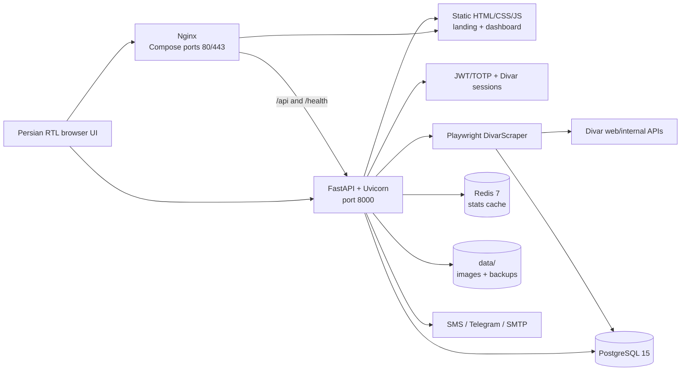
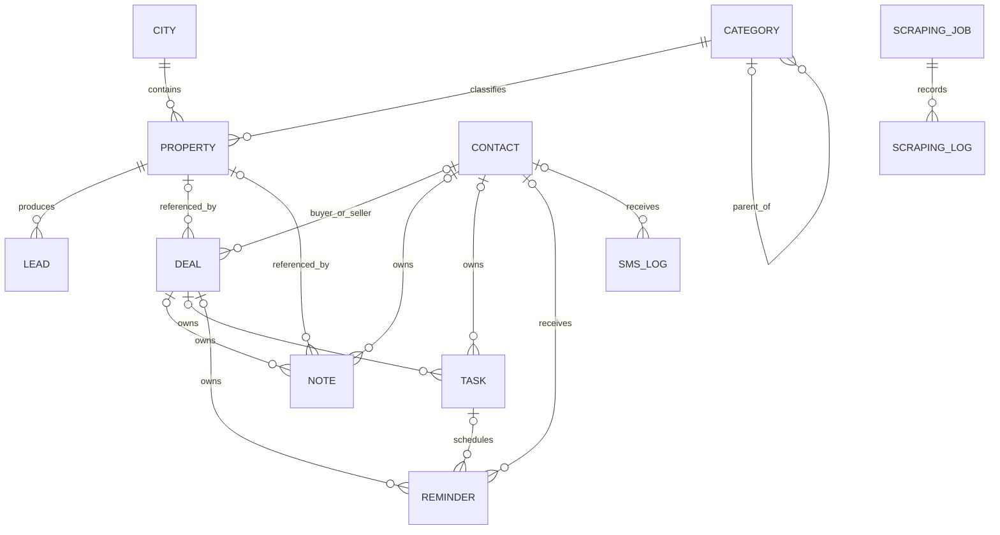

<div align="center">

# SorinFlow

**Divar property collection, data management, and real-estate CRM in one Persian RTL workspace.**

[](https://fastapi.tiangolo.com/)
[](https://playwright.dev/python/)
[](https://www.postgresql.org/)
[](LICENSE)

</div>

SorinFlow is a FastAPI application for collecting real-estate listings from Divar, managing the resulting property inventory, and moving new opportunities through a built-in CRM. It combines a Playwright scraper, PostgreSQL data model, Redis-backed analytics cache, role-aware dashboard, Divar session management, and optional SMS, Telegram, and email integrations.

> [!CAUTION]
> This repository can process phone numbers, browser sessions, and other personal or confidential data. Use it only where you have permission and a lawful basis, respect Divar's terms and rate limits, and apply appropriate retention and access controls.

> [!IMPORTANT]
> At the time of this README update, runtime secrets and session artifacts are already tracked in the repository despite matching `.gitignore` rules. Treat previously committed credentials, cookies, and private-key material as compromised: rotate or revoke them, remove them from Git history, and do not deploy the checkout unchanged. `.gitignore` does not untrack files that are already committed.

**Navigate:** [Project brain](#project-brain) · [Architecture](#architecture) · [Quick start](#quick-start) · [API](#api-overview) · [Configuration](#configuration) · [Developer map](#developer-change-map) · [Operations](#operations)

## What the project includes

- **Divar collection:** configurable city/category jobs, exact-date and recency modes, price/area/room/amenity filters, advertiser filtering, duplicate updates, and single-listing collection.
- **Authenticated contact extraction:** separate Divar phone/OTP sessions, cookie import and refresh, per-user linked Divar numbers, and scrape-time OTP pause/resume.
- **Property inventory:** Persian-aware parsing, stable Divar IDs, human-facing tags, incremental serial numbers, local JPEG image storage, filtering, pagination, soft deletion, and JSON/CSV export.
- **CRM:** leads, contacts, structured customer profiles, tasks, deals, notes, reminders, SMS logs, lead notifications, reporting, and daily performance assessment (DPA).
- **Dashboard security:** username/password JWT login, optional TOTP, three dashboard roles, and super-admin account management.
- **Operations:** PostgreSQL, Redis, Docker Compose, Nginx, health checks, nightly JSON backups, Kubernetes manifests, and a GitHub Actions deployment workflow.

## Project brain

The repository includes a Graphify-generated knowledge graph of the project-owned code. Vendored minified frontend libraries and runtime data are excluded through [`.graphifyignore`](.graphifyignore).

| Artifact | Purpose |
|---|---|
| [`graphify-out/PROJECT_BRAIN.html`](graphify-out/PROJECT_BRAIN.html) | Collapsible source hierarchy with a symbol relationship inspector |
| [`graphify-out/graph.html`](graphify-out/graph.html) | Interactive dependency and community graph |
| [`graphify-out/CALLFLOW.html`](graphify-out/CALLFLOW.html) | Architecture communities, Mermaid call flows, and call tables |
| [`graphify-out/GRAPH_REPORT.md`](graphify-out/GRAPH_REPORT.md) | Hubs, communities, inferred relationships, and graph health |
| [`graphify-out/graph.json`](graphify-out/graph.json) | Machine-readable node and edge data |

The current graph contains **1,227 nodes**, **2,570 relationships**, and **71 detected communities**. Graphify reports no import cycles, dangling edges, duplicate edges, or endpoint-collapse risks. Its highest-connectivity project abstractions include `apiCall()`, `DivarScraper`, `User`, `Property`, `DivarAuth`, `Cookie`, and `Lead`.

Refresh the brain after changing code:

```bash
graphify update .
graphify cluster-only . --no-label
graphify tree \
  --graph graphify-out/graph.json \
  --output graphify-out/PROJECT_BRAIN.html \
  --root "$PWD" \
  --label SorinFlow
graphify export callflow-html graphify-out/graph.json \
  --output graphify-out/CALLFLOW.html
```

Useful graph queries:

```bash
graphify explain DivarScraper
graphify path DivarScraper Lead
graphify affected Property --depth 2
graphify query "How does a scrape create a CRM lead?"
```

## Architecture



### Scrape-to-CRM lifecycle

1. A user signs in to SorinFlow and starts a job through `POST /api/scraper/start`.
2. FastAPI validates the city/category, enforces a maximum of three database-tracked running jobs, creates a job record, and starts an in-process background task.
3. `DivarScraper` restores the selected Divar session, discovers listings through browser traffic and page markup, and opens each detail page.
4. Parsers normalize Persian/Arabic digits and extract pricing, location, area, rooms, features, amenities, advertiser details, publication time, phone number, and images.
5. Filters and validation run before the property is inserted or updated in PostgreSQL. Images are converted to JPEG and saved under `data/images/`.
6. Every newly inserted property creates one CRM lead. Configured Telegram and SMTP notifications are attempted without failing the scrape if delivery is unavailable.
7. The dashboard polls job progress, pending OTP requests, properties, CRM records, and cached statistics.

Redis is used for dashboard/public-stat caching and health checks. It is **not** a Celery broker, and scrape jobs are not durable queue jobs.

### Core data model



`User`, `Cookie`, `Customer`, and `DailyPerformance` are separate aggregates rather than foreign-key children in this graph. Users and scraping jobs are associated with a Divar phone value, but that association is not enforced by a database foreign key.

## Technology stack

| Layer | Technology |
|---|---|
| API | FastAPI 0.109, Uvicorn 0.27, Pydantic 2.5 |
| Persistence | PostgreSQL 15, SQLAlchemy async 2.0, asyncpg |
| Cache | Redis 7 |
| Collection | Playwright 1.41, Beautiful Soup 4.12, HTTPX, aiohttp |
| Media/data | Pillow, OpenCV, NumPy, openpyxl |
| Authentication | JWT/HS256, bcrypt, optional TOTP via PyOTP |
| Frontend | Static HTML, CSS, and JavaScript; Bootstrap RTL and Chart.js |
| Operations | Docker Compose, Nginx, k3s/Kubernetes, GitHub Actions |
| Tests | pytest and pytest-asyncio |

The source uses Python 3.10+ syntax. No authoritative Python version file is checked in, so Docker is the canonical runtime.

## Quick start

### Local development — the short way

No Docker needed. `./local/start.sh` brings up PostgreSQL, Redis and the API,
creates the database on first run, and prints the logins:

```bash
./local/start.sh          # http://127.0.0.1:8010
./local/stop.sh           # stops all three, keeps your data
```

It is idempotent and safe to re-run. Local values live in `local/local.env`,
which git ignores and which never shares credentials with production — real
environment variables take precedence over `.env`, so a local run cannot pick
up a production value by accident.

Set `AUTH_SMS_PROVIDER=console` to have portal verification codes written to the
log instead of sent by SMS (refused when `ENVIRONMENT=production`):

```bash
grep sms:console local/server.log | tail -1
```

### Requirements for the Docker path

- Git
- Docker Engine or Docker Desktop
- Docker Compose v2 (`docker compose`)
- Network access to Divar and the frontend's CDN dependencies

### 1. Clone and configure

```bash
git clone https://github.com/Tecso-Dev/SorinFlow-DaTA-mAmager.git
cd SorinFlow-DaTA-mAmager

# Replace the local configuration with the documented template.
cp .env.example .env
```

Review `.env` before starting. At minimum, replace the default database, Redis, and application secrets:

```env
POSTGRES_USER=sorinflow
POSTGRES_PASSWORD=replace-with-a-strong-password
POSTGRES_DB=divar_scraper

REDIS_PASSWORD=replace-with-a-strong-password
SECRET_KEY=replace-with-a-long-random-value

# Optional supplemental middleware key; JWT remains the primary API auth.
API_KEY=

# Leave disabled until intentionally configured.
PROXY_ENABLED=false
PROXY_LIST=
DIVAR_PHONE_NUMBER=
```

Generate a secret with:

```bash
openssl rand -hex 32
```

Never commit the resulting `.env`.

### 2. Start the stack

```bash
docker compose up -d --build
docker compose ps
```

The [`start.sh`](start.sh) wrapper can also create directories, rebuild without cache, start the stack, and perform basic health checks:

```bash
./start.sh
```

### 3. Open the application

| Service | URL | Notes |
|---|---|---|
| Dashboard (recommended locally) | <http://localhost:8000/dashboard/> | Direct FastAPI route; keep the trailing slash |
| API documentation | <http://localhost:8000/api/docs> | Swagger UI |
| ReDoc | <http://localhost:8000/api/redoc> | Alternative API reference |
| Health check | <http://localhost:8000/health> | Backend liveness |
| Backend landing page | <http://localhost:8000/> | Public marketing page |
| Nginx dashboard | <http://localhost/> | Compose serves `frontend/index.html` at `/` |

Use the direct backend dashboard during local development because the bundled Nginx configuration does not currently proxy the generated `/images/...` URLs.

On an empty database, SorinFlow seeds this super-admin account:

```text
Username: admin
Password: whatever you set in SUPER_ADMIN_PASSWORD (there is no default)
```

Change it immediately from the user-management screen. Bootstrap credentials are only read when the users table is empty; changing environment variables later does not update an existing account.

### 4. First-use workflow

1. Sign in to the SorinFlow dashboard.
2. Reset the seeded super-admin password and create any additional accounts.
3. Open **Divar Authentication**, enter a Divar phone number, and complete OTP verification or import an existing cookie set.
4. Open **Scraper**, choose a city and category, set filters, and start a job.
5. Monitor progress under scraper jobs, review the property inventory, and manage automatically created leads in CRM.

## Authentication model

Three separate authentication paths:

| Path | Who | Main endpoints |
|---|---|---|
| Dashboard | staff — `root`, `super_admin`, `admin` | `/api/users/token`, `/api/users/token/verify-totp`, `/api/users/me` |
| Customer portal | `visitor`, public sign-up by SMS | `/api/public/auth/register`, `/verify`, `/login` |
| Divar session | the scraper's own browser session for contact extraction | `/api/auth/login`, `/api/auth/verify`, `/api/auth/cookies` |

Dashboard JWTs last 24 hours and carry a `typ` claim. Only a finished access
token authenticates: the half-token issued between password and TOTP is
refused, so the second factor cannot be skipped.

### Roles

| Role | What it is |
|---|---|
| `root` | The developer. Everything, always. Seeded from `ROOT_PASSWORD`, never creatable from the panel, hidden from the super admin's user list, and protected from being edited, deleted or password-reset by anyone but another root. |
| `super_admin` | The agency owner. Runs the business — staff, permissions, upgrade tickets, visitor requests. Cannot create or become a root. |
| `admin` | An employee. Reaches only the areas ticked in `users.permissions`. |
| `visitor` | A public sign-up. No dashboard at all — the portal only. |

`root` and `super_admin` bypass permission checks; a permission list is only
ever consulted for an `admin`. Permission keys are defined in
[`app/auth/permissions.py`](app/auth/permissions.py) and gate the routers in
[`app/api/routes/__init__.py`](app/api/routes/__init__.py): `properties`,
`scraper`, `crm`, `filing`, `divar_auth`, `proxies`, `stats`, `portal`,
`monitoring`.

Enforcement is server-side at the router, not just hidden in the UI — the panel
builds its navigation from the permissions `/api/users/me` reports, so the menu
and the API cannot disagree.

### Public sign-up

Off by default (`PUBLIC_AUTH_ENABLED=false`): `/portal` redirects to the
dashboard and every `/api/public/auth/*` endpoint answers 404. When enabled, a
visitor registers with a phone number, verifies by SMS, and can describe the
property they are looking for and request an upgrade to `admin`, which a super
admin approves with a chosen set of permissions.

`API_KEY` is supplemental middleware, not a replacement for JWT. It is a
separate value from `METRICS_TOKEN`, which guards `/metrics` alone so a
monitoring scraper never needs the key that opens the rest of the API.

## API overview

All application routes are mounted below `/api`.

| Prefix | Responsibility |
|---|---|
| `/api/users` | Dashboard login, TOTP, profile, and user administration |
| `/api/auth` | Divar OTP and cookie/session management |
| `/api/scraper` | Jobs, filters, single-URL collection, and scrape-time OTP |
| `/api/properties` | Property search, detail, update, soft deletion, and export |
| `/api/crm` | Leads, contacts, customers, tasks, deals, notes, reminders, SMS, DPA, reports |
| `/api/proxies` | Proxy CRUD, import, activation, and connectivity tests |
| `/api/stats` | Dashboard totals, health, logs, job summaries, and trends |
| `/api/public/stats` | Public cached landing-page statistics |
| `/api/backup/run` | Manual super-admin backup |

### Obtain a dashboard token

The login endpoint expects OAuth form data, not JSON:

```bash
curl -X POST http://localhost:8000/api/users/token \
  -H "Content-Type: application/x-www-form-urlencoded" \
  -d "username=admin&password=YOUR_PASSWORD"
```

Copy `access_token` from the response:

```bash
export SORINFLOW_TOKEN="YOUR_ACCESS_TOKEN"
```

### Start a scrape

```bash
curl -X POST http://localhost:8000/api/scraper/start \
  -H "Authorization: Bearer $SORINFLOW_TOKEN" \
  -H "Content-Type: application/json" \
  -d '{
    "city": "tehran",
    "category": "buy-apartment",
    "max_items": 20,
    "download_images": true,
    "min_area": 80,
    "has_parking": true
  }'
```

Use `GET /api/scraper/cities` and `GET /api/scraper/categories` to discover supported slugs. Additional job filters include sale price, deposit, monthly rent, price per square meter, room count, images, elevator, storage, balcony, advertiser type, maximum listing age, and exact Gregorian publication date.

### Divar phone login

```http
POST /api/auth/login
Authorization: Bearer <token>
Content-Type: application/json

{"phone_number":"09123456789"}
```

Then submit the received code:

```http
POST /api/auth/verify?phone_number=09123456789
Authorization: Bearer <token>
Content-Type: application/json

{"code":"123456"}
```

## Configuration

Application settings live in [`app/config.py`](app/config.py). `.env.example` covers the common local values, but not every supported setting.

| Area | Variables |
|---|---|
| Core | `ENVIRONMENT`, `DEBUG`, `SECRET_KEY`, `API_KEY`, `CORS_ORIGINS` |
| Database | `POSTGRES_USER`, `POSTGRES_PASSWORD`, `POSTGRES_DB`, `DATABASE_URL` |
| Redis | `REDIS_PASSWORD`, `REDIS_URL` |
| Bootstrap admin | `SUPER_ADMIN_USERNAME`, `SUPER_ADMIN_PASSWORD` |
| Scraper | `SCRAPER_HEADLESS`, `SCRAPER_TIMEOUT`, `SCRAPER_DELAY_MIN`, `SCRAPER_DELAY_MAX`, `OTP_WAIT_TIMEOUT`, `DIVAR_PHONE_NUMBER` |
| Proxies | `PROXY_ENABLED`, `PROXY_LIST` |
| SMS | `KAVENEGAR_API_KEY`, `KAVENEGAR_SENDER`, `MELIPAYAMAK_API_KEY`, `MELIPAYAMAK_FROM` |
| Telegram | `TELEGRAM_BOT_TOKEN`, `TELEGRAM_CHAT_ID` |
| Email | `SMTP_HOST`, `SMTP_PORT`, `SMTP_USER`, `SMTP_PASSWORD`, `NOTIFICATION_EMAIL` |

### Docker Compose environment caveat

Compose uses `.env` for variable interpolation, but only variables explicitly listed under `services.backend.environment` are passed into the container. The checked-in Compose file forwards the core database, Redis, secret, API-key, environment, and proxy values; several optional integration and scraper variables are not forwarded.

To pass the complete local `.env` to the backend, add this to a local Compose override:

```yaml
services:
  backend:
    env_file:
      - .env
```

Explicit entries in `docker-compose.yml` continue to take precedence over values from `env_file`.

## Secrets and server configuration

**This repository is public.** A value written into a tracked file is published
the moment it is pushed, and stays readable in the history even after the line
is deleted. Full guide, including how to add a variable and how to rotate one
without downtime: **[SECRETS.md](SECRETS.md)**.

The short version:

| Kind of value | Where it belongs | Committed? |
|---|---|---|
| Passwords, API keys, tokens, `SECRET_KEY` | Kubernetes Secret `sorinflow-secrets` | **never** |
| TLS certificate and private key | Traefik's ACME store on the server | **never** |
| Divar session cookies | the `data-pvc` volume (`/app/data/cookies`) | **never** |
| Which variables exist, and what they mean | `.env.example` — names and comments only | yes |
| Non-secret settings (timeouts, limits, flags) | `k8s/04-backend.yaml` as plain `env:` | yes |
| Local development values | `local/local.env` — git-ignored | **never** |

Adding a new secret is four steps — declare the name in `.env.example`, read it
in `app/config.py` with an **empty** default, put the real value in the cluster
with `kubectl patch secret`, then reference it from `k8s/04-backend.yaml` via
`secretKeyRef`. Never default a setting to a working credential: a real-looking
fallback makes a misconfigured deploy look healthy instead of failing loudly.

⚠️ **`POSTGRES_PASSWORD` is the one that can take the site down.** It is stored
inside the database on its volume, so changing only the Kubernetes Secret leaves
the app presenting a password the database has never seen. It must be changed
with `ALTER USER` first — the ordered runbook is in
[SECRETS.md §4c](SECRETS.md).

If a secret is ever committed again: **rotate it first**, then purge the
history, then add it to `.gitignore`, then find the process that put it there. A
leak is usually a process rather than an accident — `renew-ssl.sh` used to copy
the TLS private key into `nginx/ssl/` on every renewal, so it reappeared no
matter how often the file was deleted.

## Monitoring and observability

Everything is computed on the box. Nothing leaves the server, which is the only
design that works from Iran and also the cheapest.

| Surface | What it gives you |
|---|---|
| **پایش سامانه** (panel) | Postgres and Redis latency, disk usage, uptime, memory, scraper jobs by status, stale-job detection, live log viewer with level and text filters, Google Cloud status |
| `GET /metrics` | Prometheus text — HTTP rate and latency by route group, scraper counters (contact reveals, rotations by reason, OTP challenges, image outcomes), process CPU/memory, disk. Guarded by `METRICS_TOKEN`; empty disables it and the path 404s |
| `GET /api/monitoring/overview` | The same health data as JSON, for the panel |
| `GET /api/stats/logs` | Windowed reverse scan over the rotating log, filterable by level and text |

Logs are written through a redaction filter on **both** sinks
([`app/log_redaction.py`](app/log_redaction.py)) — Iranian mobile numbers in
ASCII and Persian digits, URL credentials, JWTs and bearer tokens are masked
before anything reaches stdout or disk. Container stdout is persisted to the
node by containerd, so a log line is at rest on the server.

### Google Cloud

[`app/services/gcp/`](app/services/gcp/) exports to Cloud Logging (structured
`jsonPayload`), Cloud Monitoring (custom time series), and optionally Pub/Sub,
and reads platform metrics for Compute Engine, Cloud Run, Cloud Functions and
Cloud SQL. REST over `httpx` with a service-account JWT rather than the SDKs,
which would add over a hundred megabytes to an image that already carries
Chromium.

**Ships disabled** (`GCP_ENABLED=false`). Google's endpoints are not reachable
from an Iranian IP, so it is useful behind a VPN, after a migration, or pointed
at a client's project. It fails soft by design: a bounded buffer that drops
oldest rather than growing, backoff on repeated failure, and
`/api/gcp/status` distinguishing *disabled* from *unconfigured* from
*unreachable*. No request path or scrape ever waits on Google.

## Public pages

`/`, the maintenance page, 404 and 500 share one design system
([`app/error_pages.py`](app/error_pages.py)) — the landing page's palette,
gradient and infinity mark. Self-contained: no CDN stylesheet, no webfont
request, no external script, because two of them exist precisely when something
is already broken.

Error responses negotiate: anything under `/api` returns JSON, everything else
follows `Accept`, so a browser gets a page and a script still gets something
parseable. The 500 page carries a reference id that is also in the log.

Maintenance mode is stored in the database, so it survives deploys and pod
restarts. It supports a countdown, emergency contact details, and a bypass link
for whoever is allowed through — all editable from the panel while the site is
closed.

## Repository map

| Path | Purpose |
|---|---|
| `app/main.py` | FastAPI application, middleware, public routes, static mounts, and lifespan jobs |
| `app/api/routes/` | User, Divar auth, scraper, property, CRM, proxy, and statistics endpoints |
| `app/auth/` | JWT/password helpers and authenticated-user dependencies |
| `app/scraper/` | Browser automation, parsing, validation, contact extraction, OTP state, and images |
| `app/crm/` | Automatic lead creation and notification pipeline |
| `app/models/` | SQLAlchemy models for core and CRM data |
| `app/services/` | Backups, SMS providers, and DPA support |
| `frontend/` | Persian landing page and static single-page dashboard |
| `tests/` | Parser, validator, captcha, settings, and auth unit tests |
| `scripts/` | Server provisioning, deployment, survey, and backup restoration helpers |
| `k8s/` | k3s/Kubernetes resources for backend, PostgreSQL, Redis, ingress, and Traefik |
| `nginx/` | Local reverse proxy and TLS configuration |
| `migrations/` | Standalone legacy SQL patches |
| `graphify-out/` | Generated project brain and machine-readable graph |

### Key entry points

- **Application lifecycle:** `app/main.py` creates FastAPI, installs middleware, mounts static files, and starts reminder, lease-expiry, and backup schedulers.
- **API composition:** `app/api/routes/__init__.py` mounts every domain router and applies shared JWT dependencies.
- **Scrape orchestration:** `app/api/routes/scraper.py` creates jobs; `DivarScraper.start_scraping_job()` in `app/scraper/divar_scraper.py` performs collection and persistence.
- **Property-to-CRM bridge:** `app/crm/pipeline.py` creates a lead and dispatches configured notifications after a new property is saved.
- **Database startup:** `app/database.py` creates tables, applies idempotent patches, and seeds the first super admin.
- **Dashboard:** `frontend/index.html` contains the UI shell and forms; `frontend/js/app.js` owns routing, API calls, state, and rendering.
- **Production delivery:** `Dockerfile`, `docker-compose.yml`, `k8s/`, and `.github/workflows/deploy.yml`.

## Developer change map

| I want to... | Start here | Also verify |
|---|---|---|
| Add a property field | `app/models/property.py` | Schemas, parsers, `DivarScraper`, API output, dashboard rendering, initialization/migration |
| Add a scraper filter | `ScrapingJobCreate` in `app/schemas/__init__.py` | Scraper route pass-through, `start_scraping_job()`, frontend form and request payload |
| Change listing parsing | `app/scraper/parsers.py` and `app/scraper/divar_scraper.py` | Validator behavior and `tests/test_parsers.py` |
| Add an API domain or endpoint | Matching module in `app/api/routes/` | Router inclusion, JWT/role dependency, schema, frontend caller, API docs |
| Add or change a CRM entity | `app/models/crm_models.py` and `app/api/routes/crm.py` | Foreign keys, exports, dashboard tab/forms, DPA side effects |
| Change dashboard permissions | `app/auth/dependencies.py` and `app/api/routes/users.py` | `applyRoleUI()` and section routing in `frontend/js/app.js` |
| Add a setting | `app/config.py` | `.env.example`, Compose forwarding, Kubernetes secrets/environment, README configuration table |
| Change database structure | SQLAlchemy model | `init.sql`, startup patches or a migration, restore compatibility, tests |
| Change deployment | `docker-compose.yml` or `k8s/` | Health checks, volumes, ingress, secrets, and GitHub Actions |
| Assess change impact | `graphify affected "<symbol>" --depth 2` | Interactive project brain and call-flow report |

### Existing conventions

- Python files and functions use `snake_case`; classes and Pydantic/SQLAlchemy models use `PascalCase`.
- I/O paths are asynchronous. Routes receive `AsyncSession` through FastAPI dependencies, while scrape jobs create an isolated engine/session.
- Route handlers raise `HTTPException`; scraper and integration failures are logged with Loguru, with non-critical CRM notification failures kept non-fatal.
- API schemas are centralized in `app/schemas/__init__.py`; database models are separated by domain under `app/models/`.
- The frontend is a build-free JavaScript application using global `camelCase` functions, DOM IDs, and same-origin `/api` calls.
- Tests follow `tests/test_*.py`, pytest classes, and `test_*` functions.
- Recent history follows scoped Conventional Commit-style subjects such as `feat(properties):`, `fix(crm):`, and `perf(scraper):`.

## Development

### Tests

```bash
DATABASE_URL=postgresql+asyncpg://user@host/db pytest tests/ -q
```

The suite needs PostgreSQL: `scraping_jobs.job_id` is a `postgresql.UUID`
column the pinned SQLAlchemy cannot render on SQLite, so schema-building tests
skip with a message rather than failing cryptically. Add `PG_TEST_URL` to also
run the migration DDL tests — the half SQLite can never cover, because
`ALTER ... IF NOT EXISTS` is a no-op there.

CI runs both against real Postgres and Redis services on every push **and every
pull request**, and nothing reaches the registry unless they pass.


The frontend has no package manager or build step. `frontend/index.html`, `frontend/css/style.css`, and `frontend/js/app.js` are served directly. The dashboard loads several libraries from CDNs, including Bootstrap RTL, Chart.js, QRCode.js, jQuery, and Persian date-picker assets.

Compose bind-mounts `app/` and `frontend/`. After changing Python code, restart the backend:

```bash
docker compose restart backend
docker compose logs -f backend
```

Frontend edits normally need only a browser refresh.

### Tests

The checked-in pytest suite covers:

- Persian/Arabic normalization and listing parsers
- Sale/rent property validation
- Puzzle captcha solving
- Configuration behavior
- Password hashing and JWT handling

Run it in a Python 3.10+ virtual environment:

```bash
python3 -m venv .venv
source .venv/bin/activate
python -m pip install --upgrade pip
python -m pip install -r requirements.txt
python -m pytest -q
```

The project currently has no route/database integration tests or browser end-to-end tests. Its GitHub Actions deployment workflow builds and deploys the image but does not run pytest.

Native application execution is not turnkey: default service hosts are Compose names (`db` and `redis`), while several runtime paths are fixed under `/app`. Prefer Docker for running the complete system.

## Operations

### Common commands

```bash
# Status
docker compose ps

# Follow backend logs
docker compose logs -f backend

# Restart after backend changes
docker compose restart backend

# Rebuild after dependency or Dockerfile changes
docker compose up -d --build

# Stop while retaining named volumes
docker compose down
```

`docker compose down -v` deletes the PostgreSQL and Redis named volumes. Host-mounted files under `data/` are separate and may remain, so inspect both locations before assuming a reset or backup is complete.

### Backups

The application starts a nightly backup scheduler that:

- exports every known SQLAlchemy table to a gzip-compressed JSON snapshot;
- stores snapshots under `data/backups/`;
- retains the newest 14 local snapshots;
- optionally sends each snapshot to the configured Telegram chat.

A super admin can trigger the same flow with `POST /api/backup/run`. Restore with [`scripts/restore_backup.py`](scripts/restore_backup.py) against an **empty** database and a correctly configured `DATABASE_URL`:

```bash
python scripts/restore_backup.py data/backups/sorinflow-backup-YYYYMMDD-HHMM.json.gz
```

The restore script creates tables, inserts rows in foreign-key-safe order, and advances PostgreSQL sequences. Test restoration regularly; a backup is not proven until it has been restored.

### Kubernetes deployment

The `k8s/` manifests describe a single-replica backend, PostgreSQL and Redis StatefulSets, persistent volumes, Traefik ingress, and ACME TLS. The workflow in `.github/workflows/deploy.yml`:

1. builds the Docker image on pushes to `main`;
2. pushes SHA and `latest` tags to GHCR;
3. deploys through a self-hosted runner labeled `sorinflow`;
4. imports the image into k3s and waits for rollout.

Cluster secrets and the self-hosted runner must already exist. Deployment scripts and manifests contain environment-specific hosts, domains, storage sizes, and assumptions; review them before use on another server.

## Operational constraints

- Scrape tasks, Divar login sessions, pending OTP state, and active-task tracking live in the backend process. Restarting the backend can interrupt them.
- Compose intentionally runs one Uvicorn worker. Multiple workers or replicas require externalizing process-local session/job state.
- Celery and Flower appear in `requirements.txt` but are not configured or used.
- Stored Divar cookies are JSON records/files and are not encrypted by the application. Protect the database, filesystem, snapshots, and logs accordingly.
- Deleting a CRM lead also removes its linked property, related leads/notes, and downloaded images. Treat this as a destructive action.
- Schema management is mixed: `init.sql`, SQLAlchemy `create_all()`, startup `ALTER TABLE` patches, and standalone SQL files. Alembic is installed but no Alembic environment is present.
- The Compose stack publishes PostgreSQL and Redis on host ports. Restrict those ports for any non-local deployment.
- The Nginx and direct FastAPI roots intentionally differ: Nginx serves the dashboard at `/`, while FastAPI serves the public landing page at `/` and the dashboard at `/dashboard/`.

## Security checklist

- Rotate every credential or session value that has ever been committed — see
  [SECRETS.md §4](SECRETS.md). History was purged in August 2026, but purging
  does not un-publish a value that was public; only rotation does.
- Keep secrets out of tracked files entirely: [SECRETS.md](SECRETS.md) covers
  where each kind of value belongs and how to add a new one.
- There are no default credentials any more. `POSTGRES_PASSWORD`, `REDIS_PASSWORD`,
  `SECRET_KEY` and `SUPER_ADMIN_PASSWORD` have no working fallback, so an unset
  one fails loudly instead of quietly accepting a published password.
- Restrict `CORS_ORIGINS` in production.
- Put the service behind HTTPS and trusted network controls.
- Protect `data/cookies/`, `data/backups/`, `data/images/`, logs, and database volumes.
- Treat phone numbers and listing/contact data according to applicable privacy and retention requirements.
- Review proxy sources and external SMS, Telegram, SMTP, CDN, and Divar data flows.
- Keep one authoritative backup off the application host and test restore procedures.

## License

SorinFlow is released under the [MIT License](LICENSE).
